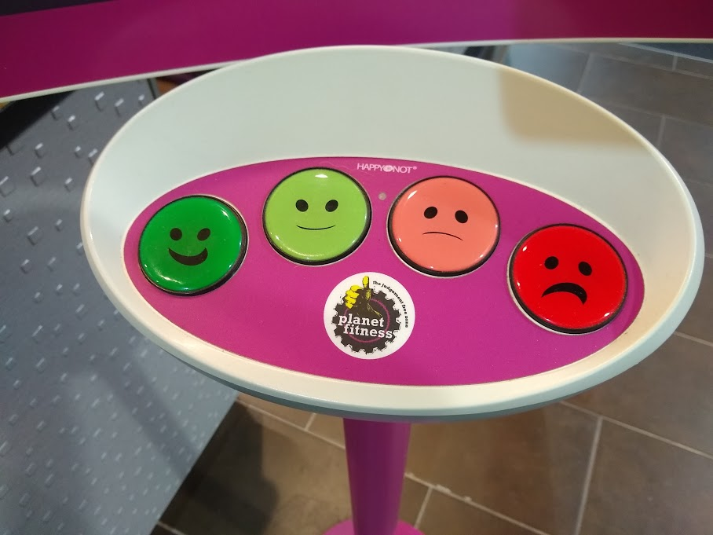

# cmustudent-portfolio
This is my public portfolio for the Telling Stories with [Data class at CMU](page2.md)!

# About me
Hello!  I'm a student in the Telling Stories with Data course.  

## What I hope to learn
I hope to learn...

Here's an example of how to add an image to my portfolio.  

Alternately, you can set the size of the image using just a bit of HTML: 

Here's an example of how to link to another page using Markdown.

[Link to other page](page2.md)

Here's some **bold** text.  Here's some *italic* text. 

# Portfolio
Here's where all of my cool data visualizations will go!  

<iframe title="This is my title" aria-label="Bar Chart" id="datawrapper-chart-hiziY" src="//datawrapper.dwcdn.net/hiziY/1/" scrolling="no" frameborder="0" style="width: 0; min-width: 100% !important; border: none;" height="299"></iframe>

<iframe id="datawrapper-chart-KUlpe" src="//datawrapper.dwcdn.net/KUlpe/1/" scrolling="no" frameborder="0" style="width: 0; min-width: 100% !important;" height="400"></iframe>

## Government debt
Government debt ratio from OECD, 1995 - 2018. 

Government debt information for 2015. 

<iframe src="https://data.oecd.org/chart/5rBZ" width="860" height="645" style="border: 0" mozallowfullscreen="true" webkitallowfullscreen="true" allowfullscreen="true"><a href="https://data.oecd.org/chart/5rBZ" target="_blank">OECD Chart: General government debt, Total, % of GDP, Annual, 2015</a></iframe>

Source: OECD (2019), General government debt (indicator). doi: 10.1787/a0528cc2-en (Accessed on 18 January 2019)

Government debt visualized using RAW with a beeswarm plot. 

<svg width="900" height="1500" xmlns="http://www.w3.org/2000/svg"><g id="swarm-AUS" transform="translate(25,0)"><text x="-25" y="23" style="font-size: 10px; font-family: Arial, Helvetica;">AUS</text><g id="circles" class="bees"><circle id="circle" r="5.493846398869749" cx="1.9999999999999976" cy="6.140961713764019" fill="rgb(0, 0, 0)"></circle><circle id="circle" r="5.362168301635338" cx="39.727272727272656" cy="6.143045994622405" fill="rgb(0, 0, 0)"></circle><circle id="circle" r="5.304908191667664" cx="77.45454545454533" cy="6.136614749828615" fill="rgb(0, 0, 0)"></circle><circle id="circle" r="5.155225954207504" cx="115.18181818181803" cy="6.1452030218887055" fill="rgb(0, 0, 0)"></circle><circle id="circle" r="4.626253642902835" cx="152.90909090909065" cy="6.139886808297173" fill="rgb(0, 0, 0)"></circle><circle id="circle" r="4.378467029652892" cx="190.63636363636337" cy="6.137258520108821" fill="rgb(0, 0, 0)"></circle><circle id="circle" r="4.329684734746854" cx="228.36363636363606" cy="6.148260686855787" fill="rgb(0, 0, 0)"></circle><circle id="circle" r="4.210824138561094" cx="266.09090909090855" cy="6.133716865869997" fill="rgb(0, 0, 0)"></circle><circle id="circle" r="3.9963924332584213" cx="303.8181818181813" cy="6.143955530078068" fill="rgb(0, 0, 0)"></circle><circle id="circle" r="3.7587485503875433" cx="341.54545454545405" cy="6.144493684801953" fill="rgb(0, 0, 0)"></circle><circle id="circle" r="3.6097310365802366" cx="379.27272727272674" cy="6.132124040763502" fill="rgb(0, 0, 0)"></circle><circle id="circle" r="3.5594984982737357" cx="416.99999999999943" cy="6.150726360836251" fill="rgb(0, 0, 0)"></circle><circle id="circle" r="3.4749032674580027" cx="454.7272727272721" cy="6.135602283232737" fill="rgb(0, 0, 0)"></circle><circle id="circle" r="3.610120345137049" cx="492.4545454545449" cy="6.138572911804568" fill="rgb(0, 0, 0)"></circle><circle id="circle" r="4.210432068950688" cx="530.1818181818171" cy="6.150406401260101" fill="rgb(0, 0, 0)"></circle><circle id="circle" r="4.433492066735891" cx="567.9090909090899" cy="6.129110396427516" fill="rgb(0, 0, 0)"></circle><circle id="circle" r="4.736728919322372" cx="605.6363636363626" cy="6.1489156904359605" fill="rgb(0, 0, 0)"></circle><circle id="circle" r="5.629738554152628" cx="643.3636363636354" cy="6.141487366648546" fill="rgb(0, 0, 0)"></circle><circle id="circle" r="5.389451652728502" cx="681.0909090909081" cy="6.131727573121663" fill="rgb(0, 0, 0)"></circle><circle id="circle" r="5.794041950921988" cx="718.8181818181808" cy="6.154397098770466" fill="rgb(0, 0, 0)"></circle><circle id="circle" r="5.976825079398734" cx="756.5454545454534" cy="6.1303669566312236" fill="rgb(0, 0, 0)"></circle><circle id="circle" r="6.278274149782835" cx="794.2727272727261" cy="6.142847228729639" fill="rgb(0, 0, 0)"></circle><circle id="circle" r="6.076383149905973" cx="831.9999999999989" cy="6.14922751290065" fill="rgb(0, 0, 0)"></circle></g><g id="labels" class="label"><text x="1.9999999999999976" y="6.140961713764019" text-anchor="middle" fill="#000"></text><text x="39.727272727272656" y="6.143045994622405" text-anchor="middle" fill="#000"></text><text x="77.45454545454533" y="6.136614749828615" text-anchor="middle" fill="#000"></text><text x="115.18181818181803" y="6.1452030218887055" text-anchor="middle" fill="#000"></text><text x="152.90909090909065" y="6.139886808297173" text-anchor="middle" fill="#000"></text><text x="190.63636363636337" y="6.137258520108821" text-anchor="middle" fill="#000"></text><text x="228.36363636363606" y="6.148260686855787" text-anchor="middle" fill="#000"></text><text x="266.09090909090855" y="6.133716865869997" text-anchor="middle" fill="#000"></text><text x="303.8181818181813" y="6.143955530078068" text-anchor="middle" fill="#000"></text><text x="341.54545454545405" y="6.144493684801953" text-anchor="middle" fill="#000"></text><text x="379.27272727272674" y="6.132124040763502" text-anchor="middle" fill="#000"></text><text x="416.99999999999943" y="6.150726360836251" text-anchor="middle" fill="#000"></text><text x="454.7272727272721" y="6.135602283232737" text-anchor="middle" fill="#000"></text><text x="492.4545454545449" y="6.138572911804568" text-anchor="middle" fill="#000"></text><text x="530.1818181818171" y="6.150406401260101" text-anchor="middle" fill="#000"></text><text x="567.9090909090899" y="6.129110396427516" text-anchor="middle" fill="#000"></text><text x="605.6363636363626" y="6.1489156904359605" text-anchor="middle" fill="#000"></text><text x="643.3636363636354" y="6.141487366648546" text-anchor="middle" fill="#000"></text><text x="681.0909090909081" y="6.131727573121663" text-anchor="middle" fill="#000"></text><text x="718.8181818181808" y="6.154397098770466" text-anchor="middle" fill="#000"></text><text x="756.5454545454534" y="6.1303669566312236" text-anchor="middle" fill="#000"></text><text x="794.2727272727261" y="6.142847228729639" text-anchor="middle" fill="#000"></text><text x="831.9999999999989" y="6.14922751290065" text-anchor="middle" fill="#000"></text></g></g><g id="swarm-AUT" transform="translate(25,42.285714285714285)"><text x="-25" y="23" style="font-size: 10px; font-family: Arial, Helvetica;">AUT</text><g id="circles" class="bees"><circle id="circle" r="6.3148436143773985" cx="1.9999999999999976" cy="6.140961713764019" fill="rgb(0, 0, 0)"></circle><circle id="circle" r="6.351948723369277" cx="39.727272727272656" cy="6.143045994622405" fill="rgb(0, 0, 0)"></circle><circle id="circle" r="6.052403399438521" cx="77.45454545454533" cy="6.136614749828615" fill="rgb(0, 0, 0)"></circle><circle id="circle" r="6.17285505275806" cx="115.18181818181803" cy="6.1452030218887055" fill="rgb(0, 0, 0)"></circle><circle id="circle" r="6.421921414349014" cx="152.90909090909065" cy="6.139886808297173" fill="rgb(0, 0, 0)"></circle><circle id="circle" r="6.445514617313248" cx="190.63636363636337" cy="6.137258520108821" fill="rgb(0, 0, 0)"></circle><circle id="circle" r="6.518324290861241" cx="228.36363636363606" cy="6.148260686855787" fill="rgb(0, 0, 0)"></circle><circle id="circle" r="6.650331643736785" cx="266.09090909090855" cy="6.133716865869997" fill="rgb(0, 0, 0)"></circle><circle id="circle" r="6.547267725428044" cx="303.8181818181813" cy="6.143955530078068" fill="rgb(0, 0, 0)"></circle><circle id="circle" r="6.494449460430377" cx="341.54545454545405" cy="6.144493684801953" fill="rgb(0, 0, 0)"></circle><circle id="circle" r="6.803397552376896" cx="379.27272727272674" cy="6.132124040763502" fill="rgb(0, 0, 0)"></circle><circle id="circle" r="6.5572868986587585" cx="416.99999999999943" cy="6.150726360836251" fill="rgb(0, 0, 0)"></circle><circle id="circle" r="6.300389498810661" cx="454.7272727272721" cy="6.135602283232737" fill="rgb(0, 0, 0)"></circle><circle id="circle" r="6.661269557551041" cx="492.4545454545449" cy="6.138572911804568" fill="rgb(0, 0, 0)"></circle><circle id="circle" r="7.499087801819234" cx="530.1818181818171" cy="6.150406401260101" fill="rgb(0, 0, 0)"></circle><circle id="circle" r="7.789932355610605" cx="567.9090909090899" cy="6.129110396427516" fill="rgb(0, 0, 0)"></circle><circle id="circle" r="7.854108214568877" cx="605.6363636363626" cy="6.1494237684596875" fill="rgb(0, 0, 0)"></circle><circle id="circle" r="8.258869007821819" cx="643.3636363636354" cy="6.141025161753197" fill="rgb(0, 0, 0)"></circle><circle id="circle" r="8.053318231405568" cx="681.0909090909081" cy="6.131727573121663" fill="rgb(0, 0, 0)"></circle><circle id="circle" r="8.571671530586134" cx="718.8181818181808" cy="6.154397098770466" fill="rgb(0, 0, 0)"></circle><circle id="circle" r="8.497654586353985" cx="756.5454545454534" cy="6.1303669566312236" fill="rgb(0, 0, 0)"></circle><circle id="circle" r="8.535080667826215" cx="794.2727272727262" cy="6.139311890208321" fill="rgb(0, 0, 0)"></circle><circle id="circle" r="8.091501531826063" cx="831.9999999999989" cy="6.153137334400964" fill="rgb(0, 0, 0)"></circle></g><g id="labels" class="label"><text x="1.9999999999999976" y="6.140961713764019" text-anchor="middle" fill="#000"></text><text x="39.727272727272656" y="6.143045994622405" text-anchor="middle" fill="#000"></text><text x="77.45454545454533" y="6.136614749828615" text-anchor="middle" fill="#000"></text><text x="115.18181818181803" y="6.1452030218887055" text-anchor="middle" fill="#000"></text><text x="152.90909090909065" y="6.139886808297173" text-anchor="middle" fill="#000"></text><text x="190.63636363636337" y="6.137258520108821" text-anchor="middle" fill="#000"></text><text x="228.36363636363606" y="6.148260686855787" text-anchor="middle" fill="#000"></text><text x="266.09090909090855" y="6.133716865869997" text-anchor="middle" fill="#000"></text><text x="303.8181818181813" y="6.143955530078068" text-anchor="middle" fill="#000"></text><text x="341.54545454545405" y="6.144493684801953" text-anchor="middle" fill="#000"></text><text x="379.27272727272674" y="6.132124040763502" text-anchor="middle" fill="#000"></text><text x="416.99999999999943" y="6.150726360836251" text-anchor="middle" fill="#000"></text><text x="454.7272727272721" y="6.135602283232737" text-anchor="middle" fill="#000"></text><text x="492.4545454545449" y="6.138572911804568" text-anchor="middle" fill="#000"></text><text x="530.1818181818171" y="6.150406401260101" text-anchor="middle" fill="#000"></text><text x="567.9090909090899" y="6.129110396427516" text-anchor="middle" fill="#000"></text><text x="605.6363636363626" y="6.1494237684596875" text-anchor="middle" fill="#000"></text><text x="643.3636363636354" y="6.141025161753197" text-anchor="middle" fill="#000"></text><text x="681.0909090909081" y="6.131727573121663" text-anchor="middle" fill="#000"></text><text x="718.8181818181808" y="6.154397098770466" text-anchor="middle" fill="#000"></text><text x="756.5454545454534" y="6.1303669566312236" text-anchor="middle" fill="#000"></text><text x="794.2727272727262" y="6.139311890208321" text-anchor="middle" fill="#000"></text><text x="831.9999999999989" y="6.153137334400964" text-anchor="middle" fill="#000"></text></g></g><g id="swarm-BEL" transform="translate(25,84.57142857142857)"><text x="-25" y="23" style="font-size: 10px; font-family: Arial, Helvetica;">BEL</text><g id="circles" class="bees"><circle id="circle" r="11.229296057349638" cx="1.9999999999999976" cy="6.140961713764019" fill="rgb(0, 0, 0)"></circle><circle id="circle" r="11.358616905077822" cx="39.727272727272656" cy="6.143045994622405" fill="rgb(0, 0, 0)"></circle><circle id="circle" r="10.98475644312672" cx="77.45454545454533" cy="6.136614749828615" fill="rgb(0, 0, 0)"></circle><circle id="circle" r="11.066856371756506" cx="115.18181818181803" cy="6.1452030218887055" fill="rgb(0, 0, 0)"></circle><circle id="circle" r="10.283724935505994" cx="152.90909090909065" cy="6.139886808297173" fill="rgb(0, 0, 0)"></circle><circle id="circle" r="9.86042780894698" cx="190.63636363636337" cy="6.137258520108821" fill="rgb(0, 0, 0)"></circle><circle id="circle" r="9.770755690834527" cx="228.36363636363606" cy="6.148260686855787" fill="rgb(0, 0, 0)"></circle><circle id="circle" r="9.71439568433863" cx="266.09090909090855" cy="6.133716865869997" fill="rgb(0, 0, 0)"></circle><circle id="circle" r="9.467543687730394" cx="303.81818181818136" cy="6.143838168797155" fill="rgb(0, 0, 0)"></circle><circle id="circle" r="9.165360177090182" cx="341.545454545454" cy="6.144618499304875" fill="rgb(0, 0, 0)"></circle><circle id="circle" r="9.01580080651497" cx="379.27272727272674" cy="6.132124040763502" fill="rgb(0, 0, 0)"></circle><circle id="circle" r="8.468456444593098" cx="416.99999999999943" cy="6.150726360836251" fill="rgb(0, 0, 0)"></circle><circle id="circle" r="8.038251852204269" cx="454.7272727272721" cy="6.135602283232737" fill="rgb(0, 0, 0)"></circle><circle id="circle" r="8.54417143678581" cx="492.4545454545449" cy="6.138572911804568" fill="rgb(0, 0, 0)"></circle><circle id="circle" r="9.122094467265775" cx="530.1818181818171" cy="6.150406401260101" fill="rgb(0, 0, 0)"></circle><circle id="circle" r="8.993491493472138" cx="567.9090909090899" cy="6.129110396427516" fill="rgb(0, 0, 0)"></circle><circle id="circle" r="9.17447855658572" cx="605.6363636363626" cy="6.1523368908623235" fill="rgb(0, 0, 0)"></circle><circle id="circle" r="9.855947999490052" cx="643.3636363636354" cy="6.138501613299665" fill="rgb(0, 0, 0)"></circle><circle id="circle" r="9.718088593521154" cx="681.0909090909081" cy="6.131727573121663" fill="rgb(0, 0, 0)"></circle><circle id="circle" r="10.590181176583558" cx="718.8181818181808" cy="6.154397098770466" fill="rgb(0, 0, 0)"></circle><circle id="circle" r="10.352426851568904" cx="756.5454545454534" cy="6.1303669566312236" fill="rgb(0, 0, 0)"></circle><circle id="circle" r="10.405735893842976" cx="794.2727272727262" cy="6.135836650798423" fill="rgb(0, 0, 0)"></circle><circle id="circle" r="9.954200091647134" cx="831.9999999999989" cy="6.1568567683619" fill="rgb(0, 0, 0)"></circle></g><g id="labels" class="label"><text x="1.9999999999999976" y="6.140961713764019" text-anchor="middle" fill="#000"></text><text x="39.727272727272656" y="6.143045994622405" text-anchor="middle" fill="#000"></text><text x="77.45454545454533" y="6.136614749828615" text-anchor="middle" fill="#000"></text><text x="115.18181818181803" y="6.1452030218887055" text-anchor="middle" fill="#000"></text><text x="152.90909090909065" y="6.139886808297173" text-anchor="middle" fill="#000"></text><text x="190.63636363636337" y="6.137258520108821" text-anchor="middle" fill="#000"></text><text x="228.36363636363606" y="6.148260686855787" text-anchor="middle" fill="#000"></text><text x="266.09090909090855" y="6.133716865869997" text-anchor="middle" fill="#000"></text><text x="303.81818181818136" y="6.143838168797155" text-anchor="middle" fill="#000"></text><text x="341.545454545454" y="6.144618499304875" text-anchor="middle" fill="#000"></text><text x="379.27272727272674" y="6.132124040763502" text-anchor="middle" fill="#000"></text><text x="416.99999999999943" y="6.150726360836251" text-anchor="middle" fill="#000"></text><text x="454.7272727272721" y="6.135602283232737" text-anchor="middle" fill="#000"></text><text x="492.4545454545449" y="6.138572911804568" text-anchor="middle" fill="#000"></text><text x="530.1818181818171" y="6.150406401260101" text-anchor="middle" fill="#000"></text><text x="567.9090909090899" y="6.129110396427516" text-anchor="middle" fill="#000"></text><text x="605.6363636363626" y="6.1523368908623235" text-anchor="middle" fill="#000"></text><text x="643.3636363636354" y="6.138501613299665" text-anchor="middle" fill="#000"></text><text x="681.0909090909081" y="6.131727573121663" text-anchor="middle" fill="#000"></text><text x="718.8181818181808" y="6.154397098770466" text-anchor="middle" fill="#000"></text><text x="756.5454545454534" y="6.1303669566312236" text-anchor="middle" fill="#000"></text><text x="794.2727272727262" y="6.135836650798423" text-anchor="middle" fill="#000"></text><text x="831.9999999999989" y="6.1568567683619" text-anchor="middle" fill="#000"></text></g></g><g id="swarm-CAN" transform="translate(25,126.85714285714286)"><text x="-25" y="23" style="font-size: 10px; font-family: Arial, Helvetica;">CAN</text><g id="circles" class="bees"><circle id="circle" r="10.124025595605314" cx="1.9999999999999976" cy="6.140961713764019" fill="rgb(0, 0, 0)"></circle><circle id="circle" r="10.546045734876913" cx="39.727272727272656" cy="6.143045994622405" fill="rgb(0, 0, 0)"></circle><circle id="circle" r="10.123984179801399" cx="77.45454545454533" cy="6.136614749828615" fill="rgb(0, 0, 0)"></circle><circle id="circle" r="10.09235631087743" cx="115.18181818181803" cy="6.1452030218887055" fill="rgb(0, 0, 0)"></circle><circle id="circle" r="9.42759124221928" cx="152.90909090909065" cy="6.139886808297173" fill="rgb(0, 0, 0)"></circle><circle id="circle" r="8.816922116109613" cx="190.63636363636337" cy="6.137258520108821" fill="rgb(0, 0, 0)"></circle><circle id="circle" r="8.802958087555883" cx="228.36363636363606" cy="6.148260686855787" fill="rgb(0, 0, 0)"></circle><circle id="circle" r="8.717786486802318" cx="266.09090909090855" cy="6.133716865869997" fill="rgb(0, 0, 0)"></circle><circle id="circle" r="8.418980434971466" cx="303.8181818181813" cy="6.143946947041662" fill="rgb(0, 0, 0)"></circle><circle id="circle" r="8.147569556904351" cx="341.545454545454" cy="6.1445028150641425" fill="rgb(0, 0, 0)"></circle><circle id="circle" r="8.042838652487983" cx="379.27272727272674" cy="6.132124040763502" fill="rgb(0, 0, 0)"></circle><circle id="circle" r="7.850121253178551" cx="416.99999999999943" cy="6.150726360836251" fill="rgb(0, 0, 0)"></circle><circle id="circle" r="7.556491486573818" cx="454.7272727272721" cy="6.135602283232737" fill="rgb(0, 0, 0)"></circle><circle id="circle" r="7.75041063446022" cx="492.4545454545449" cy="6.138572911804568" fill="rgb(0, 0, 0)"></circle><circle id="circle" r="8.654889685921654" cx="530.1818181818171" cy="6.150406401260101" fill="rgb(0, 0, 0)"></circle><circle id="circle" r="8.803268706085255" cx="567.9090909090899" cy="6.129110396427516" fill="rgb(0, 0, 0)"></circle><circle id="circle" r="8.986754522701776" cx="605.6363636363626" cy="6.151432164289493" fill="rgb(0, 0, 0)"></circle><circle id="circle" r="9.239377121322331" cx="643.3636363636354" cy="6.139099745686023" fill="rgb(0, 0, 0)"></circle><circle id="circle" r="8.960710884672505" cx="681.0909090909081" cy="6.131727573121663" fill="rgb(0, 0, 0)"></circle><circle id="circle" r="9.03224978330367" cx="718.8181818181808" cy="6.154397098770466" fill="rgb(0, 0, 0)"></circle><circle id="circle" r="9.460475390528707" cx="756.5454545454534" cy="6.1303669566312236" fill="rgb(0, 0, 0)"></circle><circle id="circle" r="9.41778259932514" cx="794.2727272727262" cy="6.137527696328507" fill="rgb(0, 0, 0)"></circle><circle id="circle" r="9.070497278220236" cx="831.9999999999989" cy="6.154940110311927" fill="rgb(0, 0, 0)"></circle></g><g id="labels" class="label"><text x="1.9999999999999976" y="6.140961713764019" text-anchor="middle" fill="#000"></text><text x="39.727272727272656" y="6.143045994622405" text-anchor="middle" fill="#000"></text><text x="77.45454545454533" y="6.136614749828615" text-anchor="middle" fill="#000"></text><text x="115.18181818181803" y="6.1452030218887055" text-anchor="middle" fill="#000"></text><text x="152.90909090909065" y="6.139886808297173" text-anchor="middle" fill="#000"></text><text x="190.63636363636337" y="6.137258520108821" text-anchor="middle" fill="#000"></text><text x="228.36363636363606" y="6.148260686855787" text-anchor="middle" fill="#000"></text><text x="266.09090909090855" y="6.133716865869997" text-anchor="middle" fill="#000"></text><text x="303.8181818181813" y="6.143946947041662" text-anchor="middle" fill="#000"></text><text x="341.545454545454" y="6.1445028150641425" text-anchor="middle" fill="#000"></text><text x="379.27272727272674" y="6.132124040763502" text-anchor="middle" fill="#000"></text><text x="416.99999999999943" y="6.150726360836251" text-anchor="middle" fill="#000"></text><text x="454.7272727272721" y="6.135602283232737" text-anchor="middle" fill="#000"></text><text x="492.4545454545449" y="6.138572911804568" text-anchor="middle" fill="#000"></text><text x="530.1818181818171" y="6.150406401260101" text-anchor="middle" fill="#000"></text><text x="567.9090909090899" y="6.129110396427516" text-anchor="middle" fill="#000"></text><text x="605.6363636363626" y="6.151432164289493" text-anchor="middle" fill="#000"></text><text x="643.3636363636354" y="6.139099745686023" text-anchor="middle" fill="#000"></text><text x="681.0909090909081" y="6.131727573121663" text-anchor="middle" fill="#000"></text><text x="718.8181818181808" y="6.154397098770466" text-anchor="middle" fill="#000"></text><text x="756.5454545454534" y="6.1303669566312236" text-anchor="middle" fill="#000"></text><text x="794.2727272727262" y="6.137527696328507" text-anchor="middle" fill="#000"></text><text x="831.9999999999989" y="6.154940110311927" text-anchor="middle" fill="#000"></text></g></g><g id="swarm-CHE" transform="translate(25,169.14285714285714)"><text x="-25" y="23" style="font-size: 10px; font-family: Arial, Helvetica;">CHE</text><g id="circles" class="bees"><circle id="circle" r="5.322806031330029" cx="152.90909090909065" cy="6.140961713764019" fill="rgb(0, 0, 0)"></circle><circle id="circle" r="5.303994973191313" cx="190.63636363636334" cy="6.143045994622405" fill="rgb(0, 0, 0)"></circle><circle id="circle" r="5.242145992149729" cx="228.36363636363606" cy="6.136614749828615" fill="rgb(0, 0, 0)"></circle><circle id="circle" r="5.670060980845394" cx="266.0909090909086" cy="6.1452030218887055" fill="rgb(0, 0, 0)"></circle><circle id="circle" r="5.616916911523586" cx="303.8181818181813" cy="6.139886808297173" fill="rgb(0, 0, 0)"></circle><circle id="circle" r="5.666461257221681" cx="341.54545454545405" cy="6.137258520108821" fill="rgb(0, 0, 0)"></circle><circle id="circle" r="5.46950978222522" cx="379.2727272727267" cy="6.148260686855787" fill="rgb(0, 0, 0)"></circle><circle id="circle" r="5.028233364922807" cx="416.99999999999943" cy="6.133716865869997" fill="rgb(0, 0, 0)"></circle><circle id="circle" r="4.688358021401902" cx="454.7272727272721" cy="6.143955530078068" fill="rgb(0, 0, 0)"></circle><circle id="circle" r="4.711140855136176" cx="492.45454545454487" cy="6.144493684801953" fill="rgb(0, 0, 0)"></circle><circle id="circle" r="4.591536845270121" cx="530.1818181818172" cy="6.132124040763502" fill="rgb(0, 0, 0)"></circle><circle id="circle" r="4.482238467945201" cx="567.9090909090899" cy="6.150726360836251" fill="rgb(0, 0, 0)"></circle><circle id="circle" r="4.509933216023931" cx="605.6363636363626" cy="6.135602283232737" fill="rgb(0, 0, 0)"></circle><circle id="circle" r="4.564233476538398" cx="643.3636363636354" cy="6.138572911804568" fill="rgb(0, 0, 0)"></circle><circle id="circle" r="4.513575045714958" cx="681.0909090909081" cy="6.150406401260101" fill="rgb(0, 0, 0)"></circle><circle id="circle" r="4.517995492519609" cx="718.8181818181808" cy="6.129110396427516" fill="rgb(0, 0, 0)"></circle><circle id="circle" r="4.52074136031925" cx="756.5454545454535" cy="6.1489156904359605" fill="rgb(0, 0, 0)"></circle><circle id="circle" r="4.471060342468231" cx="794.2727272727261" cy="6.141487366648546" fill="rgb(0, 0, 0)"></circle></g><g id="labels" class="label"><text x="152.90909090909065" y="6.140961713764019" text-anchor="middle" fill="#000"></text><text x="190.63636363636334" y="6.143045994622405" text-anchor="middle" fill="#000"></text><text x="228.36363636363606" y="6.136614749828615" text-anchor="middle" fill="#000"></text><text x="266.0909090909086" y="6.1452030218887055" text-anchor="middle" fill="#000"></text><text x="303.8181818181813" y="6.139886808297173" text-anchor="middle" fill="#000"></text><text x="341.54545454545405" y="6.137258520108821" text-anchor="middle" fill="#000"></text><text x="379.2727272727267" y="6.148260686855787" text-anchor="middle" fill="#000"></text><text x="416.99999999999943" y="6.133716865869997" text-anchor="middle" fill="#000"></text><text x="454.7272727272721" y="6.143955530078068" text-anchor="middle" fill="#000"></text><text x="492.45454545454487" y="6.144493684801953" text-anchor="middle" fill="#000"></text><text x="530.1818181818172" y="6.132124040763502" text-anchor="middle" fill="#000"></text><text x="567.9090909090899" y="6.150726360836251" text-anchor="middle" fill="#000"></text><text x="605.6363636363626" y="6.135602283232737" text-anchor="middle" fill="#000"></text><text x="643.3636363636354" y="6.138572911804568" text-anchor="middle" fill="#000"></text><text x="681.0909090909081" y="6.150406401260101" text-anchor="middle" fill="#000"></text><text x="718.8181818181808" y="6.129110396427516" text-anchor="middle" fill="#000"></text><text x="756.5454545454535" y="6.1489156904359605" text-anchor="middle" fill="#000"></text><text x="794.2727272727261" y="6.141487366648546" text-anchor="middle" fill="#000"></text></g></g><g id="swarm-CHL" transform="translate(25,211.42857142857142)"><text x="-25" y="23" style="font-size: 10px; font-family: Arial, Helvetica;">CHL</text><g id="circles" class="bees"><circle id="circle" r="3.1900508902299007" cx="303.8181818181813" cy="6.140961713764019" fill="rgb(0, 0, 0)"></circle><circle id="circle" r="2.960776451067079" cx="341.54545454545405" cy="6.143045994622405" fill="rgb(0, 0, 0)"></circle><circle id="circle" r="2.664933009743029" cx="379.27272727272674" cy="6.136614749828615" fill="rgb(0, 0, 0)"></circle><circle id="circle" r="2.447598056585835" cx="416.99999999999943" cy="6.1452030218887055" fill="rgb(0, 0, 0)"></circle><circle id="circle" r="2.3173964327610346" cx="454.7272727272721" cy="6.139886808297173" fill="rgb(0, 0, 0)"></circle><circle id="circle" r="2.397922560842005" cx="492.4545454545449" cy="6.137258520108821" fill="rgb(0, 0, 0)"></circle><circle id="circle" r="2.4587934386477692" cx="530.1818181818172" cy="6.148260686855787" fill="rgb(0, 0, 0)"></circle><circle id="circle" r="2.594061595818312" cx="567.9090909090899" cy="6.133716865869997" fill="rgb(0, 0, 0)"></circle><circle id="circle" r="2.7724277288074006" cx="605.6363636363626" cy="6.143955530078068" fill="rgb(0, 0, 0)"></circle><circle id="circle" r="2.8077995864053884" cx="643.3636363636354" cy="6.144493684801953" fill="rgb(0, 0, 0)"></circle><circle id="circle" r="2.8507367308520597" cx="681.0909090909081" cy="6.132124040763502" fill="rgb(0, 0, 0)"></circle><circle id="circle" r="3.0852040215625687" cx="718.8181818181808" cy="6.150726360836251" fill="rgb(0, 0, 0)"></circle><circle id="circle" r="3.2248518999972444" cx="756.5454545454534" cy="6.135602283232737" fill="rgb(0, 0, 0)"></circle><circle id="circle" r="3.4782972925889313" cx="794.2727272727261" cy="6.138572911804568" fill="rgb(0, 0, 0)"></circle><circle id="circle" r="3.586525071382619" cx="831.9999999999989" cy="6.150406401260101" fill="rgb(0, 0, 0)"></circle></g><g id="labels" class="label"><text x="303.8181818181813" y="6.140961713764019" text-anchor="middle" fill="#000"></text><text x="341.54545454545405" y="6.143045994622405" text-anchor="middle" fill="#000"></text><text x="379.27272727272674" y="6.136614749828615" text-anchor="middle" fill="#000"></text><text x="416.99999999999943" y="6.1452030218887055" text-anchor="middle" fill="#000"></text><text x="454.7272727272721" y="6.139886808297173" text-anchor="middle" fill="#000"></text><text x="492.4545454545449" y="6.137258520108821" text-anchor="middle" fill="#000"></text><text x="530.1818181818172" y="6.148260686855787" text-anchor="middle" fill="#000"></text><text x="567.9090909090899" y="6.133716865869997" text-anchor="middle" fill="#000"></text><text x="605.6363636363626" y="6.143955530078068" text-anchor="middle" fill="#000"></text><text x="643.3636363636354" y="6.144493684801953" text-anchor="middle" fill="#000"></text><text x="681.0909090909081" y="6.132124040763502" text-anchor="middle" fill="#000"></text><text x="718.8181818181808" y="6.150726360836251" text-anchor="middle" fill="#000"></text><text x="756.5454545454534" y="6.135602283232737" text-anchor="middle" fill="#000"></text><text x="794.2727272727261" y="6.138572911804568" text-anchor="middle" fill="#000"></text><text x="831.9999999999989" y="6.150406401260101" text-anchor="middle" fill="#000"></text></g></g><g id="swarm-COL" transform="translate(25,253.71428571428572)"><text x="-25" y="23" style="font-size: 10px; font-family: Arial, Helvetica;">COL</text><g id="circles" class="bees"><circle id="circle" r="6.304051346140247" cx="756.5454545454535" cy="6.140961713764019" fill="rgb(0, 0, 0)"></circle><circle id="circle" r="6.63340224362266" cx="794.2727272727261" cy="6.143045994622405" fill="rgb(0, 0, 0)"></circle></g><g id="labels" class="label"><text x="756.5454545454535" y="6.140961713764019" text-anchor="middle" fill="#000"></text><text x="794.2727272727261" y="6.143045994622405" text-anchor="middle" fill="#000"></text></g></g><g id="swarm-CZE" transform="translate(25,296)"><text x="-25" y="23" style="font-size: 10px; font-family: Arial, Helvetica;">CZE</text><g id="circles" class="bees"><circle id="circle" r="2.7938155402130995" cx="1.9999999999999976" cy="6.140961713764019" fill="rgb(0, 0, 0)"></circle><circle id="circle" r="2.6964352507284515" cx="39.727272727272656" cy="6.143045994622405" fill="rgb(0, 0, 0)"></circle><circle id="circle" r="2.722442995060997" cx="77.45454545454533" cy="6.136614749828615" fill="rgb(0, 0, 0)"></circle><circle id="circle" r="2.7814356661591635" cx="115.18181818181803" cy="6.1452030218887055" fill="rgb(0, 0, 0)"></circle><circle id="circle" r="3.184430765638479" cx="152.90909090909065" cy="6.139886808297173" fill="rgb(0, 0, 0)"></circle><circle id="circle" r="3.223302258667382" cx="190.63636363636337" cy="6.137258520108821" fill="rgb(0, 0, 0)"></circle><circle id="circle" r="3.494780092284161" cx="228.36363636363606" cy="6.148260686855787" fill="rgb(0, 0, 0)"></circle><circle id="circle" r="3.6515009456198717" cx="266.09090909090855" cy="6.133716865869997" fill="rgb(0, 0, 0)"></circle><circle id="circle" r="3.8448409625148448" cx="303.8181818181813" cy="6.143955530078068" fill="rgb(0, 0, 0)"></circle><circle id="circle" r="3.807811092233414" cx="341.54545454545405" cy="6.144493684801953" fill="rgb(0, 0, 0)"></circle><circle id="circle" r="3.7759754540264665" cx="379.27272727272674" cy="6.132124040763502" fill="rgb(0, 0, 0)"></circle><circle id="circle" r="3.7447603626148633" cx="416.99999999999943" cy="6.150726360836251" fill="rgb(0, 0, 0)"></circle><circle id="circle" r="3.6480751683726074" cx="454.7272727272721" cy="6.135602283232737" fill="rgb(0, 0, 0)"></circle><circle id="circle" r="3.9082030009261652" cx="492.4545454545449" cy="6.138572911804568" fill="rgb(0, 0, 0)"></circle><circle id="circle" r="4.375473357293153" cx="530.1818181818171" cy="6.150406401260101" fill="rgb(0, 0, 0)"></circle><circle id="circle" r="4.686087745083897" cx="567.9090909090899" cy="6.129110396427516" fill="rgb(0, 0, 0)"></circle><circle id="circle" r="4.877249980956281" cx="605.6363636363626" cy="6.1489156904359605" fill="rgb(0, 0, 0)"></circle><circle id="circle" r="5.5351883446022505" cx="643.3636363636354" cy="6.141487366648546" fill="rgb(0, 0, 0)"></circle><circle id="circle" r="5.540756699438777" cx="681.0909090909081" cy="6.131727573121663" fill="rgb(0, 0, 0)"></circle><circle id="circle" r="5.353729141324024" cx="718.8181818181808" cy="6.154397098770466" fill="rgb(0, 0, 0)"></circle><circle id="circle" r="5.130282596035602" cx="756.5454545454534" cy="6.1303669566312236" fill="rgb(0, 0, 0)"></circle><circle id="circle" r="4.831794755631506" cx="794.2727272727261" cy="6.142847228729639" fill="rgb(0, 0, 0)"></circle><circle id="circle" r="4.578186460877749" cx="831.9999999999989" cy="6.14922751290065" fill="rgb(0, 0, 0)"></circle></g><g id="labels" class="label"><text x="1.9999999999999976" y="6.140961713764019" text-anchor="middle" fill="#000"></text><text x="39.727272727272656" y="6.143045994622405" text-anchor="middle" fill="#000"></text><text x="77.45454545454533" y="6.136614749828615" text-anchor="middle" fill="#000"></text><text x="115.18181818181803" y="6.1452030218887055" text-anchor="middle" fill="#000"></text><text x="152.90909090909065" y="6.139886808297173" text-anchor="middle" fill="#000"></text><text x="190.63636363636337" y="6.137258520108821" text-anchor="middle" fill="#000"></text><text x="228.36363636363606" y="6.148260686855787" text-anchor="middle" fill="#000"></text><text x="266.09090909090855" y="6.133716865869997" text-anchor="middle" fill="#000"></text><text x="303.8181818181813" y="6.143955530078068" text-anchor="middle" fill="#000"></text><text x="341.54545454545405" y="6.144493684801953" text-anchor="middle" fill="#000"></text><text x="379.27272727272674" y="6.132124040763502" text-anchor="middle" fill="#000"></text><text x="416.99999999999943" y="6.150726360836251" text-anchor="middle" fill="#000"></text><text x="454.7272727272721" y="6.135602283232737" text-anchor="middle" fill="#000"></text><text x="492.4545454545449" y="6.138572911804568" text-anchor="middle" fill="#000"></text><text x="530.1818181818171" y="6.150406401260101" text-anchor="middle" fill="#000"></text><text x="567.9090909090899" y="6.129110396427516" text-anchor="middle" fill="#000"></text><text x="605.6363636363626" y="6.1489156904359605" text-anchor="middle" fill="#000"></text><text x="643.3636363636354" y="6.141487366648546" text-anchor="middle" fill="#000"></text><text x="681.0909090909081" y="6.131727573121663" text-anchor="middle" fill="#000"></text><text x="718.8181818181808" y="6.154397098770466" text-anchor="middle" fill="#000"></text><text x="756.5454545454534" y="6.1303669566312236" text-anchor="middle" fill="#000"></text><text x="794.2727272727261" y="6.142847228729639" text-anchor="middle" fill="#000"></text><text x="831.9999999999989" y="6.14922751290065" text-anchor="middle" fill="#000"></text></g></g><g id="swarm-DEU" transform="translate(25,338.2857142857143)"><text x="-25" y="23" style="font-size: 10px; font-family: Arial, Helvetica;">DEU</text><g id="circles" class="bees"><circle id="circle" r="5.2759702792080505" cx="1.9999999999999976" cy="6.140961713764019" fill="rgb(0, 0, 0)"></circle><circle id="circle" r="5.48823041585872" cx="39.727272727272656" cy="6.143045994622405" fill="rgb(0, 0, 0)"></circle><circle id="circle" r="5.589164871582772" cx="77.45454545454533" cy="6.136614749828615" fill="rgb(0, 0, 0)"></circle><circle id="circle" r="5.719465203073572" cx="115.18181818181803" cy="6.1452030218887055" fill="rgb(0, 0, 0)"></circle><circle id="circle" r="5.713481309671087" cx="152.90909090909065" cy="6.139886808297173" fill="rgb(0, 0, 0)"></circle><circle id="circle" r="5.648399825133847" cx="190.63636363636337" cy="6.137258520108821" fill="rgb(0, 0, 0)"></circle><circle id="circle" r="5.595801754160335" cx="228.36363636363606" cy="6.148260686855787" fill="rgb(0, 0, 0)"></circle><circle id="circle" r="5.764742340441506" cx="266.09090909090855" cy="6.133716865869997" fill="rgb(0, 0, 0)"></circle><circle id="circle" r="5.998031351530601" cx="303.8181818181813" cy="6.143955530078068" fill="rgb(0, 0, 0)"></circle><circle id="circle" r="6.201369833754331" cx="341.54545454545405" cy="6.144493684801953" fill="rgb(0, 0, 0)"></circle><circle id="circle" r="6.376228048151723" cx="379.27272727272674" cy="6.132124040763502" fill="rgb(0, 0, 0)"></circle><circle id="circle" r="6.251536797037966" cx="416.99999999999943" cy="6.150726360836251" fill="rgb(0, 0, 0)"></circle><circle id="circle" r="5.970349718456443" cx="454.7272727272721" cy="6.135602283232737" fill="rgb(0, 0, 0)"></circle><circle id="circle" r="6.239543470487247" cx="492.4545454545449" cy="6.138572911804568" fill="rgb(0, 0, 0)"></circle><circle id="circle" r="6.749531467540151" cx="530.1818181818171" cy="6.150406401260101" fill="rgb(0, 0, 0)"></circle><circle id="circle" r="7.369291362609415" cx="567.9090909090899" cy="6.129110396427516" fill="rgb(0, 0, 0)"></circle><circle id="circle" r="7.3508081795850355" cx="605.6363636363626" cy="6.1489156904359605" fill="rgb(0, 0, 0)"></circle><circle id="circle" r="7.6216268116561485" cx="643.3636363636354" cy="6.141487366648546" fill="rgb(0, 0, 0)"></circle><circle id="circle" r="7.287978334254037" cx="681.0909090909081" cy="6.131727573121663" fill="rgb(0, 0, 0)"></circle><circle id="circle" r="7.293042106546185" cx="718.8181818181808" cy="6.154397098770466" fill="rgb(0, 0, 0)"></circle><circle id="circle" r="6.990618384243257" cx="756.5454545454534" cy="6.1303669566312236" fill="rgb(0, 0, 0)"></circle><circle id="circle" r="6.786965141909764" cx="794.2727272727261" cy="6.142374971638589" fill="rgb(0, 0, 0)"></circle><circle id="circle" r="6.476940239061426" cx="831.9999999999989" cy="6.149742672581697" fill="rgb(0, 0, 0)"></circle></g><g id="labels" class="label"><text x="1.9999999999999976" y="6.140961713764019" text-anchor="middle" fill="#000"></text><text x="39.727272727272656" y="6.143045994622405" text-anchor="middle" fill="#000"></text><text x="77.45454545454533" y="6.136614749828615" text-anchor="middle" fill="#000"></text><text x="115.18181818181803" y="6.1452030218887055" text-anchor="middle" fill="#000"></text><text x="152.90909090909065" y="6.139886808297173" text-anchor="middle" fill="#000"></text><text x="190.63636363636337" y="6.137258520108821" text-anchor="middle" fill="#000"></text><text x="228.36363636363606" y="6.148260686855787" text-anchor="middle" fill="#000"></text><text x="266.09090909090855" y="6.133716865869997" text-anchor="middle" fill="#000"></text><text x="303.8181818181813" y="6.143955530078068" text-anchor="middle" fill="#000"></text><text x="341.54545454545405" y="6.144493684801953" text-anchor="middle" fill="#000"></text><text x="379.27272727272674" y="6.132124040763502" text-anchor="middle" fill="#000"></text><text x="416.99999999999943" y="6.150726360836251" text-anchor="middle" fill="#000"></text><text x="454.7272727272721" y="6.135602283232737" text-anchor="middle" fill="#000"></text><text x="492.4545454545449" y="6.138572911804568" text-anchor="middle" fill="#000"></text><text x="530.1818181818171" y="6.150406401260101" text-anchor="middle" fill="#000"></text><text x="567.9090909090899" y="6.129110396427516" text-anchor="middle" fill="#000"></text><text x="605.6363636363626" y="6.1489156904359605" text-anchor="middle" fill="#000"></text><text x="643.3636363636354" y="6.141487366648546" text-anchor="middle" fill="#000"></text><text x="681.0909090909081" y="6.131727573121663" text-anchor="middle" fill="#000"></text><text x="718.8181818181808" y="6.154397098770466" text-anchor="middle" fill="#000"></text><text x="756.5454545454534" y="6.1303669566312236" text-anchor="middle" fill="#000"></text><text x="794.2727272727261" y="6.142374971638589" text-anchor="middle" fill="#000"></text><text x="831.9999999999989" y="6.149742672581697" text-anchor="middle" fill="#000"></text></g></g><g id="swarm-DNK" transform="translate(25,380.57142857142856)"><text x="-25" y="23" style="font-size: 10px; font-family: Arial, Helvetica;">DNK</text><g id="circles" class="bees"><circle id="circle" r="7.169538108478025" cx="1.9999999999999976" cy="6.140961713764019" fill="rgb(0, 0, 0)"></circle><circle id="circle" r="7.001938703980339" cx="39.727272727272656" cy="6.143045994622405" fill="rgb(0, 0, 0)"></circle><circle id="circle" r="6.717140857560727" cx="77.45454545454533" cy="6.136614749828615" fill="rgb(0, 0, 0)"></circle><circle id="circle" r="6.549513842527096" cx="115.18181818181803" cy="6.1452030218887055" fill="rgb(0, 0, 0)"></circle><circle id="circle" r="6.171371676714464" cx="152.90909090909065" cy="6.139886808297173" fill="rgb(0, 0, 0)"></circle><circle id="circle" r="5.71305472689075" cx="190.63636363636337" cy="6.137258520108821" fill="rgb(0, 0, 0)"></circle><circle id="circle" r="5.5626656597104205" cx="228.36363636363606" cy="6.148260686855787" fill="rgb(0, 0, 0)"></circle><circle id="circle" r="5.55372122659133" cx="266.09090909090855" cy="6.133716865869997" fill="rgb(0, 0, 0)"></circle><circle id="circle" r="5.41026171366957" cx="303.8181818181813" cy="6.143955530078068" fill="rgb(0, 0, 0)"></circle><circle id="circle" r="5.1525684401228835" cx="341.54545454545405" cy="6.144493684801953" fill="rgb(0, 0, 0)"></circle><circle id="circle" r="4.654442619574965" cx="379.27272727272674" cy="6.132124040763502" fill="rgb(0, 0, 0)"></circle><circle id="circle" r="4.335074311363142" cx="416.99999999999943" cy="6.150726360836251" fill="rgb(0, 0, 0)"></circle><circle id="circle" r="3.9278989767418895" cx="454.7272727272721" cy="6.135602283232737" fill="rgb(0, 0, 0)"></circle><circle id="circle" r="4.434971991462494" cx="492.4545454545449" cy="6.138572911804568" fill="rgb(0, 0, 0)"></circle><circle id="circle" r="4.94076525784209" cx="530.1818181818171" cy="6.150406401260101" fill="rgb(0, 0, 0)"></circle><circle id="circle" r="5.228869465941008" cx="567.9090909090899" cy="6.129110396427516" fill="rgb(0, 0, 0)"></circle><circle id="circle" r="5.689268940438306" cx="605.6363636363626" cy="6.1489156904359605" fill="rgb(0, 0, 0)"></circle><circle id="circle" r="5.724057525464475" cx="643.3636363636354" cy="6.141487366648546" fill="rgb(0, 0, 0)"></circle><circle id="circle" r="5.456028938050513" cx="681.0909090909081" cy="6.131727573121663" fill="rgb(0, 0, 0)"></circle><circle id="circle" r="5.622363780001959" cx="718.8181818181808" cy="6.154397098770466" fill="rgb(0, 0, 0)"></circle><circle id="circle" r="5.252796066126768" cx="756.5454545454534" cy="6.1303669566312236" fill="rgb(0, 0, 0)"></circle><circle id="circle" r="5.170819004381935" cx="794.2727272727261" cy="6.142847228729639" fill="rgb(0, 0, 0)"></circle><circle id="circle" r="4.988336140483581" cx="831.9999999999989" cy="6.14922751290065" fill="rgb(0, 0, 0)"></circle></g><g id="labels" class="label"><text x="1.9999999999999976" y="6.140961713764019" text-anchor="middle" fill="#000"></text><text x="39.727272727272656" y="6.143045994622405" text-anchor="middle" fill="#000"></text><text x="77.45454545454533" y="6.136614749828615" text-anchor="middle" fill="#000"></text><text x="115.18181818181803" y="6.1452030218887055" text-anchor="middle" fill="#000"></text><text x="152.90909090909065" y="6.139886808297173" text-anchor="middle" fill="#000"></text><text x="190.63636363636337" y="6.137258520108821" text-anchor="middle" fill="#000"></text><text x="228.36363636363606" y="6.148260686855787" text-anchor="middle" fill="#000"></text><text x="266.09090909090855" y="6.133716865869997" text-anchor="middle" fill="#000"></text><text x="303.8181818181813" y="6.143955530078068" text-anchor="middle" fill="#000"></text><text x="341.54545454545405" y="6.144493684801953" text-anchor="middle" fill="#000"></text><text x="379.27272727272674" y="6.132124040763502" text-anchor="middle" fill="#000"></text><text x="416.99999999999943" y="6.150726360836251" text-anchor="middle" fill="#000"></text><text x="454.7272727272721" y="6.135602283232737" text-anchor="middle" fill="#000"></text><text x="492.4545454545449" y="6.138572911804568" text-anchor="middle" fill="#000"></text><text x="530.1818181818171" y="6.150406401260101" text-anchor="middle" fill="#000"></text><text x="567.9090909090899" y="6.129110396427516" text-anchor="middle" fill="#000"></text><text x="605.6363636363626" y="6.1489156904359605" text-anchor="middle" fill="#000"></text><text x="643.3636363636354" y="6.141487366648546" text-anchor="middle" fill="#000"></text><text x="681.0909090909081" y="6.131727573121663" text-anchor="middle" fill="#000"></text><text x="718.8181818181808" y="6.154397098770466" text-anchor="middle" fill="#000"></text><text x="756.5454545454534" y="6.1303669566312236" text-anchor="middle" fill="#000"></text><text x="794.2727272727261" y="6.142847228729639" text-anchor="middle" fill="#000"></text><text x="831.9999999999989" y="6.14922751290065" text-anchor="middle" fill="#000"></text></g></g><g id="swarm-ESP" transform="translate(25,422.85714285714283)"><text x="-25" y="23" style="font-size: 10px; font-family: Arial, Helvetica;">ESP</text><g id="circles" class="bees"><circle id="circle" r="6.201267674771339" cx="1.9999999999999976" cy="6.140961713764019" fill="rgb(0, 0, 0)"></circle><circle id="circle" r="6.638045645505059" cx="39.727272727272656" cy="6.143045994622405" fill="rgb(0, 0, 0)"></circle><circle id="circle" r="6.582057000717611" cx="77.45454545454533" cy="6.136614749828615" fill="rgb(0, 0, 0)"></circle><circle id="circle" r="6.611257903532092" cx="115.18181818181803" cy="6.1452030218887055" fill="rgb(0, 0, 0)"></circle><circle id="circle" r="6.230217321708729" cx="152.90909090909065" cy="6.139886808297173" fill="rgb(0, 0, 0)"></circle><circle id="circle" r="6.038138416043002" cx="190.63636363636337" cy="6.137258520108821" fill="rgb(0, 0, 0)"></circle><circle id="circle" r="5.720838827236792" cx="228.36363636363606" cy="6.148260686855787" fill="rgb(0, 0, 0)"></circle><circle id="circle" r="5.630016040038867" cx="266.09090909090855" cy="6.133716865869997" fill="rgb(0, 0, 0)"></circle><circle id="circle" r="5.296354447632181" cx="303.8181818181813" cy="6.143955530078068" fill="rgb(0, 0, 0)"></circle><circle id="circle" r="5.164813712814093" cx="341.54545454545405" cy="6.144493684801953" fill="rgb(0, 0, 0)"></circle><circle id="circle" r="4.989995533693821" cx="379.27272727272674" cy="6.132124040763502" fill="rgb(0, 0, 0)"></circle><circle id="circle" r="4.693283741014329" cx="416.99999999999943" cy="6.150726360836251" fill="rgb(0, 0, 0)"></circle><circle id="circle" r="4.425803913002255" cx="454.7272727272721" cy="6.135602283232737" fill="rgb(0, 0, 0)"></circle><circle id="circle" r="4.798550289828011" cx="492.4545454545449" cy="6.138572911804568" fill="rgb(0, 0, 0)"></circle><circle id="circle" r="5.8064287276099105" cx="530.1818181818171" cy="6.150406401260101" fill="rgb(0, 0, 0)"></circle><circle id="circle" r="6.134717309721872" cx="567.9090909090899" cy="6.129110396427516" fill="rgb(0, 0, 0)"></circle><circle id="circle" r="6.902471057978316" cx="605.6363636363626" cy="6.1489156904359605" fill="rgb(0, 0, 0)"></circle><circle id="circle" r="7.926763269115584" cx="643.3636363636354" cy="6.141487366648546" fill="rgb(0, 0, 0)"></circle><circle id="circle" r="8.838416918342094" cx="681.0909090909081" cy="6.131727573121663" fill="rgb(0, 0, 0)"></circle><circle id="circle" r="9.713153210221146" cx="718.8181818181808" cy="6.154397098770466" fill="rgb(0, 0, 0)"></circle><circle id="circle" r="9.568701788795597" cx="756.5454545454534" cy="6.1303669566312236" fill="rgb(0, 0, 0)"></circle><circle id="circle" r="9.582679622617297" cx="794.2727272727262" cy="6.13687934161032" fill="rgb(0, 0, 0)"></circle><circle id="circle" r="9.454601249006597" cx="831.9999999999989" cy="6.155349956583753" fill="rgb(0, 0, 0)"></circle></g><g id="labels" class="label"><text x="1.9999999999999976" y="6.140961713764019" text-anchor="middle" fill="#000"></text><text x="39.727272727272656" y="6.143045994622405" text-anchor="middle" fill="#000"></text><text x="77.45454545454533" y="6.136614749828615" text-anchor="middle" fill="#000"></text><text x="115.18181818181803" y="6.1452030218887055" text-anchor="middle" fill="#000"></text><text x="152.90909090909065" y="6.139886808297173" text-anchor="middle" fill="#000"></text><text x="190.63636363636337" y="6.137258520108821" text-anchor="middle" fill="#000"></text><text x="228.36363636363606" y="6.148260686855787" text-anchor="middle" fill="#000"></text><text x="266.09090909090855" y="6.133716865869997" text-anchor="middle" fill="#000"></text><text x="303.8181818181813" y="6.143955530078068" text-anchor="middle" fill="#000"></text><text x="341.54545454545405" y="6.144493684801953" text-anchor="middle" fill="#000"></text><text x="379.27272727272674" y="6.132124040763502" text-anchor="middle" fill="#000"></text><text x="416.99999999999943" y="6.150726360836251" text-anchor="middle" fill="#000"></text><text x="454.7272727272721" y="6.135602283232737" text-anchor="middle" fill="#000"></text><text x="492.4545454545449" y="6.138572911804568" text-anchor="middle" fill="#000"></text><text x="530.1818181818171" y="6.150406401260101" text-anchor="middle" fill="#000"></text><text x="567.9090909090899" y="6.129110396427516" text-anchor="middle" fill="#000"></text><text x="605.6363636363626" y="6.1489156904359605" text-anchor="middle" fill="#000"></text><text x="643.3636363636354" y="6.141487366648546" text-anchor="middle" fill="#000"></text><text x="681.0909090909081" y="6.131727573121663" text-anchor="middle" fill="#000"></text><text x="718.8181818181808" y="6.154397098770466" text-anchor="middle" fill="#000"></text><text x="756.5454545454534" y="6.1303669566312236" text-anchor="middle" fill="#000"></text><text x="794.2727272727262" y="6.13687934161032" text-anchor="middle" fill="#000"></text><text x="831.9999999999989" y="6.155349956583753" text-anchor="middle" fill="#000"></text></g></g><g id="swarm-EST" transform="translate(25,465.1428571428571)"><text x="-25" y="23" style="font-size: 10px; font-family: Arial, Helvetica;">EST</text><g id="circles" class="bees"><circle id="circle" r="2.4566515513219054" cx="1.9999999999999976" cy="6.140961713764019" fill="rgb(0, 0, 0)"></circle><circle id="circle" r="2.3834353126321357" cx="39.727272727272656" cy="6.143045994622405" fill="rgb(0, 0, 0)"></circle><circle id="circle" r="2.316619196174208" cx="77.45454545454533" cy="6.136614749828615" fill="rgb(0, 0, 0)"></circle><circle id="circle" r="2.232707326123092" cx="115.18181818181803" cy="6.1452030218887055" fill="rgb(0, 0, 0)"></circle><circle id="circle" r="2.285883147561235" cx="152.90909090909065" cy="6.139886808297173" fill="rgb(0, 0, 0)"></circle><circle id="circle" r="2.0092668551525787" cx="190.63636363636337" cy="6.137258520108821" fill="rgb(0, 0, 0)"></circle><circle id="circle" r="2" cx="228.36363636363606" cy="6.148260686855787" fill="rgb(0, 0, 0)"></circle><circle id="circle" r="2.063626409292985" cx="266.09090909090855" cy="6.133716865869997" fill="rgb(0, 0, 0)"></circle><circle id="circle" r="2.1191645881865053" cx="303.8181818181813" cy="6.143955530078068" fill="rgb(0, 0, 0)"></circle><circle id="circle" r="2.1354472114961403" cx="341.54545454545405" cy="6.144493684801953" fill="rgb(0, 0, 0)"></circle><circle id="circle" r="2.103205077173756" cx="379.27272727272674" cy="6.132124040763502" fill="rgb(0, 0, 0)"></circle><circle id="circle" r="2.0926140207172983" cx="416.99999999999943" cy="6.150726360836251" fill="rgb(0, 0, 0)"></circle><circle id="circle" r="2.040257403880617" cx="454.7272727272721" cy="6.135602283232737" fill="rgb(0, 0, 0)"></circle><circle id="circle" r="2.120315050192956" cx="492.4545454545449" cy="6.138572911804568" fill="rgb(0, 0, 0)"></circle><circle id="circle" r="2.419661026054195" cx="530.1818181818171" cy="6.150406401260101" fill="rgb(0, 0, 0)"></circle><circle id="circle" r="2.3638345931654183" cx="567.9090909090899" cy="6.129110396427516" fill="rgb(0, 0, 0)"></circle><circle id="circle" r="2.1984037891871213" cx="605.6363636363626" cy="6.1489156904359605" fill="rgb(0, 0, 0)"></circle><circle id="circle" r="2.447964586450493" cx="643.3636363636354" cy="6.141487366648546" fill="rgb(0, 0, 0)"></circle><circle id="circle" r="2.48034346195214" cx="681.0909090909081" cy="6.131727573121663" fill="rgb(0, 0, 0)"></circle><circle id="circle" r="2.4961056266592285" cx="718.8181818181808" cy="6.154397098770466" fill="rgb(0, 0, 0)"></circle><circle id="circle" r="2.4203229886534547" cx="756.5454545454534" cy="6.1303669566312236" fill="rgb(0, 0, 0)"></circle><circle id="circle" r="2.418845824980445" cx="794.2727272727261" cy="6.142847228729639" fill="rgb(0, 0, 0)"></circle><circle id="circle" r="2.4065584462219216" cx="831.9999999999989" cy="6.14922751290065" fill="rgb(0, 0, 0)"></circle></g><g id="labels" class="label"><text x="1.9999999999999976" y="6.140961713764019" text-anchor="middle" fill="#000"></text><text x="39.727272727272656" y="6.143045994622405" text-anchor="middle" fill="#000"></text><text x="77.45454545454533" y="6.136614749828615" text-anchor="middle" fill="#000"></text><text x="115.18181818181803" y="6.1452030218887055" text-anchor="middle" fill="#000"></text><text x="152.90909090909065" y="6.139886808297173" text-anchor="middle" fill="#000"></text><text x="190.63636363636337" y="6.137258520108821" text-anchor="middle" fill="#000"></text><text x="228.36363636363606" y="6.148260686855787" text-anchor="middle" fill="#000"></text><text x="266.09090909090855" y="6.133716865869997" text-anchor="middle" fill="#000"></text><text x="303.8181818181813" y="6.143955530078068" text-anchor="middle" fill="#000"></text><text x="341.54545454545405" y="6.144493684801953" text-anchor="middle" fill="#000"></text><text x="379.27272727272674" y="6.132124040763502" text-anchor="middle" fill="#000"></text><text x="416.99999999999943" y="6.150726360836251" text-anchor="middle" fill="#000"></text><text x="454.7272727272721" y="6.135602283232737" text-anchor="middle" fill="#000"></text><text x="492.4545454545449" y="6.138572911804568" text-anchor="middle" fill="#000"></text><text x="530.1818181818171" y="6.150406401260101" text-anchor="middle" fill="#000"></text><text x="567.9090909090899" y="6.129110396427516" text-anchor="middle" fill="#000"></text><text x="605.6363636363626" y="6.1489156904359605" text-anchor="middle" fill="#000"></text><text x="643.3636363636354" y="6.141487366648546" text-anchor="middle" fill="#000"></text><text x="681.0909090909081" y="6.131727573121663" text-anchor="middle" fill="#000"></text><text x="718.8181818181808" y="6.154397098770466" text-anchor="middle" fill="#000"></text><text x="756.5454545454534" y="6.1303669566312236" text-anchor="middle" fill="#000"></text><text x="794.2727272727261" y="6.142847228729639" text-anchor="middle" fill="#000"></text><text x="831.9999999999989" y="6.14922751290065" text-anchor="middle" fill="#000"></text></g></g><g id="swarm-FIN" transform="translate(25,507.42857142857144)"><text x="-25" y="23" style="font-size: 10px; font-family: Arial, Helvetica;">FIN</text><g id="circles" class="bees"><circle id="circle" r="5.882630355498636" cx="1.9999999999999976" cy="6.140961713764019" fill="rgb(0, 0, 0)"></circle><circle id="circle" r="5.9410342319177945" cx="39.727272727272656" cy="6.143045994622405" fill="rgb(0, 0, 0)"></circle><circle id="circle" r="5.831142918333475" cx="77.45454545454533" cy="6.136614749828615" fill="rgb(0, 0, 0)"></circle><circle id="circle" r="5.62080240419432" cx="115.18181818181803" cy="6.1452030218887055" fill="rgb(0, 0, 0)"></circle><circle id="circle" r="5.199596085469674" cx="152.90909090909065" cy="6.139886808297173" fill="rgb(0, 0, 0)"></circle><circle id="circle" r="5.0611113008616435" cx="190.63636363636337" cy="6.137258520108821" fill="rgb(0, 0, 0)"></circle><circle id="circle" r="4.881246606034189" cx="228.36363636363606" cy="6.148260686855787" fill="rgb(0, 0, 0)"></circle><circle id="circle" r="4.869582535124604" cx="266.09090909090855" cy="6.133716865869997" fill="rgb(0, 0, 0)"></circle><circle id="circle" r="4.93570217581334" cx="303.8181818181813" cy="6.143955530078068" fill="rgb(0, 0, 0)"></circle><circle id="circle" r="4.949712452014776" cx="341.54545454545405" cy="6.144493684801953" fill="rgb(0, 0, 0)"></circle><circle id="circle" r="4.751923687515809" cx="379.27272727272674" cy="6.132124040763502" fill="rgb(0, 0, 0)"></circle><circle id="circle" r="4.513783505261337" cx="416.99999999999943" cy="6.150726360836251" fill="rgb(0, 0, 0)"></circle><circle id="circle" r="4.238523718483614" cx="454.7272727272721" cy="6.135602283232737" fill="rgb(0, 0, 0)"></circle><circle id="circle" r="4.18228588860927" cx="492.4545454545449" cy="6.138572911804568" fill="rgb(0, 0, 0)"></circle><circle id="circle" r="4.938234752222813" cx="530.1818181818171" cy="6.150406401260101" fill="rgb(0, 0, 0)"></circle><circle id="circle" r="5.340926135806743" cx="567.9090909090899" cy="6.129110396427516" fill="rgb(0, 0, 0)"></circle><circle id="circle" r="5.510441711498951" cx="605.6363636363626" cy="6.1489156904359605" fill="rgb(0, 0, 0)"></circle><circle id="circle" r="5.981070889563538" cx="643.3636363636354" cy="6.141487366648546" fill="rgb(0, 0, 0)"></circle><circle id="circle" r="6.011289930890959" cx="681.0909090909081" cy="6.131727573121663" fill="rgb(0, 0, 0)"></circle><circle id="circle" r="6.488366859361891" cx="718.8181818181808" cy="6.154397098770466" fill="rgb(0, 0, 0)"></circle><circle id="circle" r="6.729569050052565" cx="756.5454545454534" cy="6.1303669566312236" fill="rgb(0, 0, 0)"></circle><circle id="circle" r="6.747580092912301" cx="794.2727272727261" cy="6.142289189782265" fill="rgb(0, 0, 0)"></circle><circle id="circle" r="6.596192904857592" cx="831.9999999999989" cy="6.149809615758918" fill="rgb(0, 0, 0)"></circle></g><g id="labels" class="label"><text x="1.9999999999999976" y="6.140961713764019" text-anchor="middle" fill="#000"></text><text x="39.727272727272656" y="6.143045994622405" text-anchor="middle" fill="#000"></text><text x="77.45454545454533" y="6.136614749828615" text-anchor="middle" fill="#000"></text><text x="115.18181818181803" y="6.1452030218887055" text-anchor="middle" fill="#000"></text><text x="152.90909090909065" y="6.139886808297173" text-anchor="middle" fill="#000"></text><text x="190.63636363636337" y="6.137258520108821" text-anchor="middle" fill="#000"></text><text x="228.36363636363606" y="6.148260686855787" text-anchor="middle" fill="#000"></text><text x="266.09090909090855" y="6.133716865869997" text-anchor="middle" fill="#000"></text><text x="303.8181818181813" y="6.143955530078068" text-anchor="middle" fill="#000"></text><text x="341.54545454545405" y="6.144493684801953" text-anchor="middle" fill="#000"></text><text x="379.27272727272674" y="6.132124040763502" text-anchor="middle" fill="#000"></text><text x="416.99999999999943" y="6.150726360836251" text-anchor="middle" fill="#000"></text><text x="454.7272727272721" y="6.135602283232737" text-anchor="middle" fill="#000"></text><text x="492.4545454545449" y="6.138572911804568" text-anchor="middle" fill="#000"></text><text x="530.1818181818171" y="6.150406401260101" text-anchor="middle" fill="#000"></text><text x="567.9090909090899" y="6.129110396427516" text-anchor="middle" fill="#000"></text><text x="605.6363636363626" y="6.1489156904359605" text-anchor="middle" fill="#000"></text><text x="643.3636363636354" y="6.141487366648546" text-anchor="middle" fill="#000"></text><text x="681.0909090909081" y="6.131727573121663" text-anchor="middle" fill="#000"></text><text x="718.8181818181808" y="6.154397098770466" text-anchor="middle" fill="#000"></text><text x="756.5454545454534" y="6.1303669566312236" text-anchor="middle" fill="#000"></text><text x="794.2727272727261" y="6.142289189782265" text-anchor="middle" fill="#000"></text><text x="831.9999999999989" y="6.149809615758918" text-anchor="middle" fill="#000"></text></g></g><g id="swarm-FRA" transform="translate(25,549.7142857142857)"><text x="-25" y="23" style="font-size: 10px; font-family: Arial, Helvetica;">FRA</text><g id="circles" class="bees"><circle id="circle" r="6.184824910353227" cx="1.9999999999999976" cy="6.140961713764019" fill="rgb(0, 0, 0)"></circle><circle id="circle" r="6.5990485245376105" cx="39.727272727272656" cy="6.143045994622405" fill="rgb(0, 0, 0)"></circle><circle id="circle" r="6.782740039646918" cx="77.45454545454533" cy="6.136614749828615" fill="rgb(0, 0, 0)"></circle><circle id="circle" r="6.89682332285095" cx="115.18181818181803" cy="6.1452030218887055" fill="rgb(0, 0, 0)"></circle><circle id="circle" r="6.64901047959186" cx="152.90909090909065" cy="6.139886808297173" fill="rgb(0, 0, 0)"></circle><circle id="circle" r="6.5395347045735" cx="190.63636363636337" cy="6.137258520108821" fill="rgb(0, 0, 0)"></circle><circle id="circle" r="6.473538621033112" cx="228.36363636363606" cy="6.148260686855787" fill="rgb(0, 0, 0)"></circle><circle id="circle" r="6.728140895080856" cx="266.09090909090855" cy="6.133716865869997" fill="rgb(0, 0, 0)"></circle><circle id="circle" r="6.998448732237004" cx="303.8181818181813" cy="6.143955530078068" fill="rgb(0, 0, 0)"></circle><circle id="circle" r="7.100047221350513" cx="341.54545454545405" cy="6.144493684801953" fill="rgb(0, 0, 0)"></circle><circle id="circle" r="7.209991685216525" cx="379.27272727272674" cy="6.132124040763502" fill="rgb(0, 0, 0)"></circle><circle id="circle" r="6.873632543448101" cx="416.99999999999943" cy="6.150726360836251" fill="rgb(0, 0, 0)"></circle><circle id="circle" r="6.781998696756819" cx="454.7272727272721" cy="6.135602283232737" fill="rgb(0, 0, 0)"></circle><circle id="circle" r="7.234927450491041" cx="492.4545454545449" cy="6.138572911804568" fill="rgb(0, 0, 0)"></circle><circle id="circle" r="8.275127471912503" cx="530.1818181818171" cy="6.150406401260101" fill="rgb(0, 0, 0)"></circle><circle id="circle" r="8.511349412182259" cx="567.9090909090899" cy="6.129110396427516" fill="rgb(0, 0, 0)"></circle><circle id="circle" r="8.705403161431388" cx="605.6363636363626" cy="6.151261614373525" fill="rgb(0, 0, 0)"></circle><circle id="circle" r="9.266697746639018" cx="643.3636363636354" cy="6.139403336205111" fill="rgb(0, 0, 0)"></circle><circle id="circle" r="9.303240290961035" cx="681.0909090909081" cy="6.131727573121663" fill="rgb(0, 0, 0)"></circle><circle id="circle" r="9.833880278636729" cx="718.8181818181808" cy="6.154397098770466" fill="rgb(0, 0, 0)"></circle><circle id="circle" r="9.880134828977084" cx="756.5454545454534" cy="6.1303669566312236" fill="rgb(0, 0, 0)"></circle><circle id="circle" r="10.20034111695481" cx="794.2727272727262" cy="6.135626365578434" fill="rgb(0, 0, 0)"></circle><circle id="circle" r="10.116336061344882" cx="831.9999999999989" cy="6.156563102812391" fill="rgb(0, 0, 0)"></circle></g><g id="labels" class="label"><text x="1.9999999999999976" y="6.140961713764019" text-anchor="middle" fill="#000"></text><text x="39.727272727272656" y="6.143045994622405" text-anchor="middle" fill="#000"></text><text x="77.45454545454533" y="6.136614749828615" text-anchor="middle" fill="#000"></text><text x="115.18181818181803" y="6.1452030218887055" text-anchor="middle" fill="#000"></text><text x="152.90909090909065" y="6.139886808297173" text-anchor="middle" fill="#000"></text><text x="190.63636363636337" y="6.137258520108821" text-anchor="middle" fill="#000"></text><text x="228.36363636363606" y="6.148260686855787" text-anchor="middle" fill="#000"></text><text x="266.09090909090855" y="6.133716865869997" text-anchor="middle" fill="#000"></text><text x="303.8181818181813" y="6.143955530078068" text-anchor="middle" fill="#000"></text><text x="341.54545454545405" y="6.144493684801953" text-anchor="middle" fill="#000"></text><text x="379.27272727272674" y="6.132124040763502" text-anchor="middle" fill="#000"></text><text x="416.99999999999943" y="6.150726360836251" text-anchor="middle" fill="#000"></text><text x="454.7272727272721" y="6.135602283232737" text-anchor="middle" fill="#000"></text><text x="492.4545454545449" y="6.138572911804568" text-anchor="middle" fill="#000"></text><text x="530.1818181818171" y="6.150406401260101" text-anchor="middle" fill="#000"></text><text x="567.9090909090899" y="6.129110396427516" text-anchor="middle" fill="#000"></text><text x="605.6363636363626" y="6.151261614373525" text-anchor="middle" fill="#000"></text><text x="643.3636363636354" y="6.139403336205111" text-anchor="middle" fill="#000"></text><text x="681.0909090909081" y="6.131727573121663" text-anchor="middle" fill="#000"></text><text x="718.8181818181808" y="6.154397098770466" text-anchor="middle" fill="#000"></text><text x="756.5454545454534" y="6.1303669566312236" text-anchor="middle" fill="#000"></text><text x="794.2727272727262" y="6.135626365578434" text-anchor="middle" fill="#000"></text><text x="831.9999999999989" y="6.156563102812391" text-anchor="middle" fill="#000"></text></g></g><g id="swarm-GBR" transform="translate(25,592)"><text x="-25" y="23" style="font-size: 10px; font-family: Arial, Helvetica;">GBR</text><g id="circles" class="bees"><circle id="circle" r="4.907980507462065" cx="1.9999999999999976" cy="6.140961713764019" fill="rgb(0, 0, 0)"></circle><circle id="circle" r="4.86157271864722" cx="39.727272727272656" cy="6.143045994622405" fill="rgb(0, 0, 0)"></circle><circle id="circle" r="4.797068984574611" cx="77.45454545454533" cy="6.136614749828615" fill="rgb(0, 0, 0)"></circle><circle id="circle" r="4.888568229903166" cx="115.18181818181803" cy="6.1452030218887055" fill="rgb(0, 0, 0)"></circle><circle id="circle" r="4.530873046483938" cx="152.90909090909065" cy="6.139886808297173" fill="rgb(0, 0, 0)"></circle><circle id="circle" r="4.639530169111556" cx="190.63636363636337" cy="6.137258520108821" fill="rgb(0, 0, 0)"></circle><circle id="circle" r="4.471968729100793" cx="228.36363636363606" cy="6.148260686855787" fill="rgb(0, 0, 0)"></circle><circle id="circle" r="4.6761838458407485" cx="266.09090909090855" cy="6.133716865869997" fill="rgb(0, 0, 0)"></circle><circle id="circle" r="4.6465453160315535" cx="303.8181818181813" cy="6.143955530078068" fill="rgb(0, 0, 0)"></circle><circle id="circle" r="4.885176965825831" cx="341.54545454545405" cy="6.144493684801953" fill="rgb(0, 0, 0)"></circle><circle id="circle" r="4.905051719861794" cx="379.27272727272674" cy="6.132124040763502" fill="rgb(0, 0, 0)"></circle><circle id="circle" r="4.841680017762894" cx="416.99999999999943" cy="6.150726360836251" fill="rgb(0, 0, 0)"></circle><circle id="circle" r="4.9682011571463445" cx="454.7272727272721" cy="6.135602283232737" fill="rgb(0, 0, 0)"></circle><circle id="circle" r="5.838073853118843" cx="492.4545454545449" cy="6.138572911804568" fill="rgb(0, 0, 0)"></circle><circle id="circle" r="6.748732832787967" cx="530.1818181818171" cy="6.150406401260101" fill="rgb(0, 0, 0)"></circle><circle id="circle" r="7.514935559187751" cx="567.9090909090899" cy="6.129110396427516" fill="rgb(0, 0, 0)"></circle><circle id="circle" r="8.46387309562638" cx="605.6363636363626" cy="6.150444999280746" fill="rgb(0, 0, 0)"></circle><circle id="circle" r="8.726504513526667" cx="643.3636363636354" cy="6.1400438818915655" fill="rgb(0, 0, 0)"></circle><circle id="circle" r="8.437415299557943" cx="681.0909090909081" cy="6.131727573121663" fill="rgb(0, 0, 0)"></circle><circle id="circle" r="9.127368079631099" cx="718.8181818181808" cy="6.154397098770466" fill="rgb(0, 0, 0)"></circle><circle id="circle" r="9.094621984001394" cx="756.5454545454534" cy="6.1303669566312236" fill="rgb(0, 0, 0)"></circle><circle id="circle" r="9.780433183682934" cx="794.2727272727262" cy="6.13656867649385" fill="rgb(0, 0, 0)"></circle><circle id="circle" r="9.609848389986292" cx="831.9999999999989" cy="6.155719730321745" fill="rgb(0, 0, 0)"></circle></g><g id="labels" class="label"><text x="1.9999999999999976" y="6.140961713764019" text-anchor="middle" fill="#000"></text><text x="39.727272727272656" y="6.143045994622405" text-anchor="middle" fill="#000"></text><text x="77.45454545454533" y="6.136614749828615" text-anchor="middle" fill="#000"></text><text x="115.18181818181803" y="6.1452030218887055" text-anchor="middle" fill="#000"></text><text x="152.90909090909065" y="6.139886808297173" text-anchor="middle" fill="#000"></text><text x="190.63636363636337" y="6.137258520108821" text-anchor="middle" fill="#000"></text><text x="228.36363636363606" y="6.148260686855787" text-anchor="middle" fill="#000"></text><text x="266.09090909090855" y="6.133716865869997" text-anchor="middle" fill="#000"></text><text x="303.8181818181813" y="6.143955530078068" text-anchor="middle" fill="#000"></text><text x="341.54545454545405" y="6.144493684801953" text-anchor="middle" fill="#000"></text><text x="379.27272727272674" y="6.132124040763502" text-anchor="middle" fill="#000"></text><text x="416.99999999999943" y="6.150726360836251" text-anchor="middle" fill="#000"></text><text x="454.7272727272721" y="6.135602283232737" text-anchor="middle" fill="#000"></text><text x="492.4545454545449" y="6.138572911804568" text-anchor="middle" fill="#000"></text><text x="530.1818181818171" y="6.150406401260101" text-anchor="middle" fill="#000"></text><text x="567.9090909090899" y="6.129110396427516" text-anchor="middle" fill="#000"></text><text x="605.6363636363626" y="6.150444999280746" text-anchor="middle" fill="#000"></text><text x="643.3636363636354" y="6.1400438818915655" text-anchor="middle" fill="#000"></text><text x="681.0909090909081" y="6.131727573121663" text-anchor="middle" fill="#000"></text><text x="718.8181818181808" y="6.154397098770466" text-anchor="middle" fill="#000"></text><text x="756.5454545454534" y="6.1303669566312236" text-anchor="middle" fill="#000"></text><text x="794.2727272727262" y="6.13656867649385" text-anchor="middle" fill="#000"></text><text x="831.9999999999989" y="6.155719730321745" text-anchor="middle" fill="#000"></text></g></g><g id="swarm-GRC" transform="translate(25,634.2857142857142)"><text x="-25" y="23" style="font-size: 10px; font-family: Arial, Helvetica;">GRC</text><g id="circles" class="bees"><circle id="circle" r="8.293846725019204" cx="1.9999999999999976" cy="6.140961713764019" fill="rgb(0, 0, 0)"></circle><circle id="circle" r="8.372367637927237" cx="39.727272727272656" cy="6.143045994622405" fill="rgb(0, 0, 0)"></circle><circle id="circle" r="8.145318607961508" cx="77.45454545454533" cy="6.136614749828615" fill="rgb(0, 0, 0)"></circle><circle id="circle" r="8.03402329862443" cx="115.18181818181803" cy="6.1452030218887055" fill="rgb(0, 0, 0)"></circle><circle id="circle" r="8.218654952482634" cx="152.90909090909065" cy="6.139886808297173" fill="rgb(0, 0, 0)"></circle><circle id="circle" r="9.2501107171706" cx="190.63636363636337" cy="6.137258520108821" fill="rgb(0, 0, 0)"></circle><circle id="circle" r="9.4987090801773" cx="228.36363636363606" cy="6.148260686855787" fill="rgb(0, 0, 0)"></circle><circle id="circle" r="9.590804022818848" cx="266.09090909090855" cy="6.133716865869997" fill="rgb(0, 0, 0)"></circle><circle id="circle" r="9.125538881624802" cx="303.81818181818136" cy="6.143834843083887" fill="rgb(0, 0, 0)"></circle><circle id="circle" r="9.432395475473555" cx="341.545454545454" cy="6.144607029854827" fill="rgb(0, 0, 0)"></circle><circle id="circle" r="9.53436118471512" cx="379.27272727272674" cy="6.132124040763502" fill="rgb(0, 0, 0)"></circle><circle id="circle" r="9.493759891609319" cx="416.99999999999943" cy="6.150726360836251" fill="rgb(0, 0, 0)"></circle><circle id="circle" r="9.325121640696736" cx="454.7272727272721" cy="6.135602283232737" fill="rgb(0, 0, 0)"></circle><circle id="circle" r="9.647088100340898" cx="492.4545454545449" cy="6.138572911804568" fill="rgb(0, 0, 0)"></circle><circle id="circle" r="10.858942133463438" cx="530.1818181818171" cy="6.150406401260101" fill="rgb(0, 0, 0)"></circle><circle id="circle" r="10.442671888302197" cx="567.9090909090899" cy="6.129110396427516" fill="rgb(0, 0, 0)"></circle><circle id="circle" r="9.195517784975126" cx="605.6363636363627" cy="6.15683768982107" fill="rgb(0, 0, 0)"></circle><circle id="circle" r="12.867725968174552" cx="643.3636363636354" cy="6.137319999625781" fill="rgb(0, 0, 0)"></circle><circle id="circle" r="13.94329439587701" cx="681.0909090909081" cy="6.131727573121663" fill="rgb(0, 0, 0)"></circle><circle id="circle" r="14.021100886167487" cx="718.8181818181808" cy="6.154397098770466" fill="rgb(0, 0, 0)"></circle><circle id="circle" r="14.167871592612341" cx="756.5454545454534" cy="6.1303669566312236" fill="rgb(0, 0, 0)"></circle><circle id="circle" r="14.364589758580074" cx="794.2727272727262" cy="6.127065914359102" fill="rgb(0, 0, 0)"></circle><circle id="circle" r="14.56764454254698" cx="831.9999999999989" cy="6.164586348588182" fill="rgb(0, 0, 0)"></circle></g><g id="labels" class="label"><text x="1.9999999999999976" y="6.140961713764019" text-anchor="middle" fill="#000"></text><text x="39.727272727272656" y="6.143045994622405" text-anchor="middle" fill="#000"></text><text x="77.45454545454533" y="6.136614749828615" text-anchor="middle" fill="#000"></text><text x="115.18181818181803" y="6.1452030218887055" text-anchor="middle" fill="#000"></text><text x="152.90909090909065" y="6.139886808297173" text-anchor="middle" fill="#000"></text><text x="190.63636363636337" y="6.137258520108821" text-anchor="middle" fill="#000"></text><text x="228.36363636363606" y="6.148260686855787" text-anchor="middle" fill="#000"></text><text x="266.09090909090855" y="6.133716865869997" text-anchor="middle" fill="#000"></text><text x="303.81818181818136" y="6.143834843083887" text-anchor="middle" fill="#000"></text><text x="341.545454545454" y="6.144607029854827" text-anchor="middle" fill="#000"></text><text x="379.27272727272674" y="6.132124040763502" text-anchor="middle" fill="#000"></text><text x="416.99999999999943" y="6.150726360836251" text-anchor="middle" fill="#000"></text><text x="454.7272727272721" y="6.135602283232737" text-anchor="middle" fill="#000"></text><text x="492.4545454545449" y="6.138572911804568" text-anchor="middle" fill="#000"></text><text x="530.1818181818171" y="6.150406401260101" text-anchor="middle" fill="#000"></text><text x="567.9090909090899" y="6.129110396427516" text-anchor="middle" fill="#000"></text><text x="605.6363636363627" y="6.15683768982107" text-anchor="middle" fill="#000"></text><text x="643.3636363636354" y="6.137319999625781" text-anchor="middle" fill="#000"></text><text x="681.0909090909081" y="6.131727573121663" text-anchor="middle" fill="#000"></text><text x="718.8181818181808" y="6.154397098770466" text-anchor="middle" fill="#000"></text><text x="756.5454545454534" y="6.1303669566312236" text-anchor="middle" fill="#000"></text><text x="794.2727272727262" y="6.127065914359102" text-anchor="middle" fill="#000"></text><text x="831.9999999999989" y="6.164586348588182" text-anchor="middle" fill="#000"></text></g></g><g id="swarm-HUN" transform="translate(25,676.5714285714286)"><text x="-25" y="23" style="font-size: 10px; font-family: Arial, Helvetica;">HUN</text><g id="circles" class="bees"><circle id="circle" r="7.569968879431532" cx="1.9999999999999976" cy="6.140961713764019" fill="rgb(0, 0, 0)"></circle><circle id="circle" r="6.764676536768889" cx="39.727272727272656" cy="6.143045994622405" fill="rgb(0, 0, 0)"></circle><circle id="circle" r="6.064578955526471" cx="77.45454545454533" cy="6.136614749828615" fill="rgb(0, 0, 0)"></circle><circle id="circle" r="5.998873472876896" cx="115.18181818181803" cy="6.1452030218887055" fill="rgb(0, 0, 0)"></circle><circle id="circle" r="6.116721452656907" cx="152.90909090909065" cy="6.139886808297173" fill="rgb(0, 0, 0)"></circle><circle id="circle" r="5.718047402052843" cx="190.63636363636337" cy="6.137258520108821" fill="rgb(0, 0, 0)"></circle><circle id="circle" r="5.577601579129382" cx="228.36363636363606" cy="6.148260686855787" fill="rgb(0, 0, 0)"></circle><circle id="circle" r="5.649007947188016" cx="266.09090909090855" cy="6.133716865869997" fill="rgb(0, 0, 0)"></circle><circle id="circle" r="5.69648840532429" cx="303.8181818181813" cy="6.143955530078068" fill="rgb(0, 0, 0)"></circle><circle id="circle" r="5.9307610417563925" cx="341.54545454545405" cy="6.144493684801953" fill="rgb(0, 0, 0)"></circle><circle id="circle" r="6.143926113722629" cx="379.27272727272674" cy="6.132124040763502" fill="rgb(0, 0, 0)"></circle><circle id="circle" r="6.38993598898457" cx="416.99999999999943" cy="6.150726360836251" fill="rgb(0, 0, 0)"></circle><circle id="circle" r="6.435826080250464" cx="454.7272727272721" cy="6.135602283232737" fill="rgb(0, 0, 0)"></circle><circle id="circle" r="6.683411826851413" cx="492.4545454545449" cy="6.138572911804568" fill="rgb(0, 0, 0)"></circle><circle id="circle" r="7.2995968477793145" cx="530.1818181818171" cy="6.150406401260101" fill="rgb(0, 0, 0)"></circle><circle id="circle" r="7.426075190832052" cx="567.9090909090899" cy="6.129110396427516" fill="rgb(0, 0, 0)"></circle><circle id="circle" r="8.043341164242166" cx="605.6363636363626" cy="6.149590677248754" fill="rgb(0, 0, 0)"></circle><circle id="circle" r="8.256738854973733" cx="643.3636363636354" cy="6.1408448772135165" fill="rgb(0, 0, 0)"></circle><circle id="circle" r="8.118441131746723" cx="681.0909090909081" cy="6.131727573121663" fill="rgb(0, 0, 0)"></circle><circle id="circle" r="8.344876517551093" cx="718.8181818181808" cy="6.154397098770466" fill="rgb(0, 0, 0)"></circle><circle id="circle" r="8.254616985286427" cx="756.5454545454534" cy="6.1303669566312236" fill="rgb(0, 0, 0)"></circle><circle id="circle" r="8.244675811819754" cx="794.2727272727262" cy="6.139787692868283" fill="rgb(0, 0, 0)"></circle><circle id="circle" r="7.8477902336814696" cx="831.9999999999989" cy="6.152584888428554" fill="rgb(0, 0, 0)"></circle></g><g id="labels" class="label"><text x="1.9999999999999976" y="6.140961713764019" text-anchor="middle" fill="#000"></text><text x="39.727272727272656" y="6.143045994622405" text-anchor="middle" fill="#000"></text><text x="77.45454545454533" y="6.136614749828615" text-anchor="middle" fill="#000"></text><text x="115.18181818181803" y="6.1452030218887055" text-anchor="middle" fill="#000"></text><text x="152.90909090909065" y="6.139886808297173" text-anchor="middle" fill="#000"></text><text x="190.63636363636337" y="6.137258520108821" text-anchor="middle" fill="#000"></text><text x="228.36363636363606" y="6.148260686855787" text-anchor="middle" fill="#000"></text><text x="266.09090909090855" y="6.133716865869997" text-anchor="middle" fill="#000"></text><text x="303.8181818181813" y="6.143955530078068" text-anchor="middle" fill="#000"></text><text x="341.54545454545405" y="6.144493684801953" text-anchor="middle" fill="#000"></text><text x="379.27272727272674" y="6.132124040763502" text-anchor="middle" fill="#000"></text><text x="416.99999999999943" y="6.150726360836251" text-anchor="middle" fill="#000"></text><text x="454.7272727272721" y="6.135602283232737" text-anchor="middle" fill="#000"></text><text x="492.4545454545449" y="6.138572911804568" text-anchor="middle" fill="#000"></text><text x="530.1818181818171" y="6.150406401260101" text-anchor="middle" fill="#000"></text><text x="567.9090909090899" y="6.129110396427516" text-anchor="middle" fill="#000"></text><text x="605.6363636363626" y="6.149590677248754" text-anchor="middle" fill="#000"></text><text x="643.3636363636354" y="6.1408448772135165" text-anchor="middle" fill="#000"></text><text x="681.0909090909081" y="6.131727573121663" text-anchor="middle" fill="#000"></text><text x="718.8181818181808" y="6.154397098770466" text-anchor="middle" fill="#000"></text><text x="756.5454545454534" y="6.1303669566312236" text-anchor="middle" fill="#000"></text><text x="794.2727272727262" y="6.139787692868283" text-anchor="middle" fill="#000"></text><text x="831.9999999999989" y="6.152584888428554" text-anchor="middle" fill="#000"></text></g></g><g id="swarm-IRL" transform="translate(25,718.8571428571429)"><text x="-25" y="23" style="font-size: 10px; font-family: Arial, Helvetica;">IRL</text><g id="circles" class="bees"><circle id="circle" r="5.769786095095094" cx="115.18181818181803" cy="6.140961713764019" fill="rgb(0, 0, 0)"></circle><circle id="circle" r="5.02469990658536" cx="152.90909090909065" cy="6.143045994622405" fill="rgb(0, 0, 0)"></circle><circle id="circle" r="4.212529089155641" cx="190.63636363636334" cy="6.136614749828615" fill="rgb(0, 0, 0)"></circle><circle id="circle" r="3.993769432343732" cx="228.36363636363606" cy="6.1452030218887055" fill="rgb(0, 0, 0)"></circle><circle id="circle" r="3.8901008432978137" cx="266.09090909090855" cy="6.139886808297173" fill="rgb(0, 0, 0)"></circle><circle id="circle" r="3.8073824386628816" cx="303.8181818181813" cy="6.137258520108821" fill="rgb(0, 0, 0)"></circle><circle id="circle" r="3.7153468586736125" cx="341.54545454545405" cy="6.148260686855787" fill="rgb(0, 0, 0)"></circle><circle id="circle" r="3.7025445434197315" cx="379.2727272727267" cy="6.133716865869997" fill="rgb(0, 0, 0)"></circle><circle id="circle" r="3.4480037028144626" cx="416.99999999999943" cy="6.143955530078068" fill="rgb(0, 0, 0)"></circle><circle id="circle" r="3.4351730867612384" cx="454.7272727272721" cy="6.144493684801953" fill="rgb(0, 0, 0)"></circle><circle id="circle" r="4.816804995667454" cx="492.4545454545449" cy="6.132124040763502" fill="rgb(0, 0, 0)"></circle><circle id="circle" r="6.202218167471214" cx="530.1818181818172" cy="6.150726360836251" fill="rgb(0, 0, 0)"></circle><circle id="circle" r="7.3035403225755315" cx="567.9090909090899" cy="6.135602283232737" fill="rgb(0, 0, 0)"></circle><circle id="circle" r="9.233413245558404" cx="605.6363636363626" cy="6.138572911804568" fill="rgb(0, 0, 0)"></circle><circle id="circle" r="10.468998534324898" cx="643.3636363636354" cy="6.150406401260101" fill="rgb(0, 0, 0)"></circle><circle id="circle" r="10.632825649349222" cx="681.0909090909081" cy="6.129110396427516" fill="rgb(0, 0, 0)"></circle><circle id="circle" r="9.905867848476985" cx="718.8181818181808" cy="6.150304908390649" fill="rgb(0, 0, 0)"></circle><circle id="circle" r="7.650092583951118" cx="756.5454545454534" cy="6.1392227123529794" fill="rgb(0, 0, 0)"></circle><circle id="circle" r="7.347545994763239" cx="794.2727272727261" cy="6.131727573121663" fill="rgb(0, 0, 0)"></circle><circle id="circle" r="6.871427842152965" cx="831.9999999999989" cy="6.154397098770466" fill="rgb(0, 0, 0)"></circle></g><g id="labels" class="label"><text x="115.18181818181803" y="6.140961713764019" text-anchor="middle" fill="#000"></text><text x="152.90909090909065" y="6.143045994622405" text-anchor="middle" fill="#000"></text><text x="190.63636363636334" y="6.136614749828615" text-anchor="middle" fill="#000"></text><text x="228.36363636363606" y="6.1452030218887055" text-anchor="middle" fill="#000"></text><text x="266.09090909090855" y="6.139886808297173" text-anchor="middle" fill="#000"></text><text x="303.8181818181813" y="6.137258520108821" text-anchor="middle" fill="#000"></text><text x="341.54545454545405" y="6.148260686855787" text-anchor="middle" fill="#000"></text><text x="379.2727272727267" y="6.133716865869997" text-anchor="middle" fill="#000"></text><text x="416.99999999999943" y="6.143955530078068" text-anchor="middle" fill="#000"></text><text x="454.7272727272721" y="6.144493684801953" text-anchor="middle" fill="#000"></text><text x="492.4545454545449" y="6.132124040763502" text-anchor="middle" fill="#000"></text><text x="530.1818181818172" y="6.150726360836251" text-anchor="middle" fill="#000"></text><text x="567.9090909090899" y="6.135602283232737" text-anchor="middle" fill="#000"></text><text x="605.6363636363626" y="6.138572911804568" text-anchor="middle" fill="#000"></text><text x="643.3636363636354" y="6.150406401260101" text-anchor="middle" fill="#000"></text><text x="681.0909090909081" y="6.129110396427516" text-anchor="middle" fill="#000"></text><text x="718.8181818181808" y="6.150304908390649" text-anchor="middle" fill="#000"></text><text x="756.5454545454534" y="6.1392227123529794" text-anchor="middle" fill="#000"></text><text x="794.2727272727261" y="6.131727573121663" text-anchor="middle" fill="#000"></text><text x="831.9999999999989" y="6.154397098770466" text-anchor="middle" fill="#000"></text></g></g><g id="swarm-ISL" transform="translate(25,761.1428571428571)"><text x="-25" y="23" style="font-size: 10px; font-family: Arial, Helvetica;">ISL</text><g id="circles" class="bees"><circle id="circle" r="6.056085264406668" cx="303.8181818181813" cy="6.140961713764019" fill="rgb(0, 0, 0)"></circle><circle id="circle" r="5.615506703400241" cx="341.54545454545405" cy="6.143045994622405" fill="rgb(0, 0, 0)"></circle><circle id="circle" r="4.956348644328941" cx="379.27272727272674" cy="6.136614749828615" fill="rgb(0, 0, 0)"></circle><circle id="circle" r="5.291383860898844" cx="416.99999999999943" cy="6.1452030218887055" fill="rgb(0, 0, 0)"></circle><circle id="circle" r="4.945568800832965" cx="454.7272727272721" cy="6.139886808297173" fill="rgb(0, 0, 0)"></circle><circle id="circle" r="8.008990206210711" cx="492.4545454545449" cy="6.137258520108821" fill="rgb(0, 0, 0)"></circle><circle id="circle" r="8.912219880920677" cx="530.1818181818172" cy="6.148260686855787" fill="rgb(0, 0, 0)"></circle><circle id="circle" r="9.19272912084477" cx="567.9090909090899" cy="6.133716865869997" fill="rgb(0, 0, 0)"></circle><circle id="circle" r="9.691499647406985" cx="605.6363636363626" cy="6.1437954826820045" fill="rgb(0, 0, 0)"></circle><circle id="circle" r="9.538488959838762" cx="643.3636363636354" cy="6.144658648395564" fill="rgb(0, 0, 0)"></circle><circle id="circle" r="8.964486625462861" cx="681.0909090909081" cy="6.132124040763502" fill="rgb(0, 0, 0)"></circle></g><g id="labels" class="label"><text x="303.8181818181813" y="6.140961713764019" text-anchor="middle" fill="#000"></text><text x="341.54545454545405" y="6.143045994622405" text-anchor="middle" fill="#000"></text><text x="379.27272727272674" y="6.136614749828615" text-anchor="middle" fill="#000"></text><text x="416.99999999999943" y="6.1452030218887055" text-anchor="middle" fill="#000"></text><text x="454.7272727272721" y="6.139886808297173" text-anchor="middle" fill="#000"></text><text x="492.4545454545449" y="6.137258520108821" text-anchor="middle" fill="#000"></text><text x="530.1818181818172" y="6.148260686855787" text-anchor="middle" fill="#000"></text><text x="567.9090909090899" y="6.133716865869997" text-anchor="middle" fill="#000"></text><text x="605.6363636363626" y="6.1437954826820045" text-anchor="middle" fill="#000"></text><text x="643.3636363636354" y="6.144658648395564" text-anchor="middle" fill="#000"></text><text x="681.0909090909081" y="6.132124040763502" text-anchor="middle" fill="#000"></text></g></g><g id="swarm-ISR" transform="translate(25,803.4285714285714)"><text x="-25" y="23" style="font-size: 10px; font-family: Arial, Helvetica;">ISR</text><g id="circles" class="bees"><circle id="circle" r="7.83584660609545" cx="228.36363636363606" cy="6.140961713764019" fill="rgb(0, 0, 0)"></circle><circle id="circle" r="8.091918450918818" cx="266.09090909090855" cy="6.143045994622405" fill="rgb(0, 0, 0)"></circle><circle id="circle" r="8.452594191693212" cx="303.8181818181813" cy="6.136614749828615" fill="rgb(0, 0, 0)"></circle><circle id="circle" r="8.30586213999868" cx="341.54545454545405" cy="6.1452030218887055" fill="rgb(0, 0, 0)"></circle><circle id="circle" r="8.12559502160984" cx="379.2727272727267" cy="6.139886808297173" fill="rgb(0, 0, 0)"></circle><circle id="circle" r="7.417389606487437" cx="416.99999999999943" cy="6.137258520108821" fill="rgb(0, 0, 0)"></circle><circle id="circle" r="7.066684030242459" cx="454.7272727272721" cy="6.148260686855787" fill="rgb(0, 0, 0)"></circle><circle id="circle" r="7.1014974647509765" cx="492.4545454545449" cy="6.133716865869997" fill="rgb(0, 0, 0)"></circle><circle id="circle" r="7.328159256950088" cx="530.1818181818172" cy="6.143955530078068" fill="rgb(0, 0, 0)"></circle><circle id="circle" r="7.063323828018062" cx="567.9090909090899" cy="6.144493684801953" fill="rgb(0, 0, 0)"></circle><circle id="circle" r="6.936977325274457" cx="605.6363636363626" cy="6.132124040763502" fill="rgb(0, 0, 0)"></circle><circle id="circle" r="6.989320689053884" cx="643.3636363636354" cy="6.150726360836251" fill="rgb(0, 0, 0)"></circle><circle id="circle" r="6.819157646293789" cx="681.0909090909081" cy="6.135602283232737" fill="rgb(0, 0, 0)"></circle><circle id="circle" r="6.888467684410867" cx="718.8181818181808" cy="6.138572911804568" fill="rgb(0, 0, 0)"></circle><circle id="circle" r="6.895534601085759" cx="756.5454545454534" cy="6.150406401260101" fill="rgb(0, 0, 0)"></circle><circle id="circle" r="6.733562223813481" cx="794.2727272727261" cy="6.129110396427516" fill="rgb(0, 0, 0)"></circle></g><g id="labels" class="label"><text x="228.36363636363606" y="6.140961713764019" text-anchor="middle" fill="#000"></text><text x="266.09090909090855" y="6.143045994622405" text-anchor="middle" fill="#000"></text><text x="303.8181818181813" y="6.136614749828615" text-anchor="middle" fill="#000"></text><text x="341.54545454545405" y="6.1452030218887055" text-anchor="middle" fill="#000"></text><text x="379.2727272727267" y="6.139886808297173" text-anchor="middle" fill="#000"></text><text x="416.99999999999943" y="6.137258520108821" text-anchor="middle" fill="#000"></text><text x="454.7272727272721" y="6.148260686855787" text-anchor="middle" fill="#000"></text><text x="492.4545454545449" y="6.133716865869997" text-anchor="middle" fill="#000"></text><text x="530.1818181818172" y="6.143955530078068" text-anchor="middle" fill="#000"></text><text x="567.9090909090899" y="6.144493684801953" text-anchor="middle" fill="#000"></text><text x="605.6363636363626" y="6.132124040763502" text-anchor="middle" fill="#000"></text><text x="643.3636363636354" y="6.150726360836251" text-anchor="middle" fill="#000"></text><text x="681.0909090909081" y="6.135602283232737" text-anchor="middle" fill="#000"></text><text x="718.8181818181808" y="6.138572911804568" text-anchor="middle" fill="#000"></text><text x="756.5454545454534" y="6.150406401260101" text-anchor="middle" fill="#000"></text><text x="794.2727272727261" y="6.129110396427516" text-anchor="middle" fill="#000"></text></g></g><g id="swarm-ITA" transform="translate(25,845.7142857142857)"><text x="-25" y="23" style="font-size: 10px; font-family: Arial, Helvetica;">ITA</text><g id="circles" class="bees"><circle id="circle" r="9.908387309881885" cx="1.9999999999999976" cy="6.140961713764019" fill="rgb(0, 0, 0)"></circle><circle id="circle" r="10.315035283266605" cx="39.727272727272656" cy="6.143045994622405" fill="rgb(0, 0, 0)"></circle><circle id="circle" r="10.421363457187338" cx="77.45454545454533" cy="6.136614749828615" fill="rgb(0, 0, 0)"></circle><circle id="circle" r="10.484184329094154" cx="115.18181818181803" cy="6.1452030218887055" fill="rgb(0, 0, 0)"></circle><circle id="circle" r="10.081491564983427" cx="152.90909090909065" cy="6.139886808297173" fill="rgb(0, 0, 0)"></circle><circle id="circle" r="9.753416274261632" cx="190.63636363636337" cy="6.137258520108821" fill="rgb(0, 0, 0)"></circle><circle id="circle" r="9.69452990372685" cx="228.36363636363606" cy="6.148260686855787" fill="rgb(0, 0, 0)"></circle><circle id="circle" r="9.613182362201542" cx="266.09090909090855" cy="6.133716865869997" fill="rgb(0, 0, 0)"></circle><circle id="circle" r="9.428750884728935" cx="303.81818181818136" cy="6.143817490397315" fill="rgb(0, 0, 0)"></circle><circle id="circle" r="9.456941241927861" cx="341.545454545454" cy="6.14463094394597" fill="rgb(0, 0, 0)"></circle><circle id="circle" r="9.645935360465232" cx="379.27272727272674" cy="6.132124040763502" fill="rgb(0, 0, 0)"></circle><circle id="circle" r="9.478974449611254" cx="416.99999999999943" cy="6.150726360836251" fill="rgb(0, 0, 0)"></circle><circle id="circle" r="9.180980837800556" cx="454.7272727272721" cy="6.135602283232737" fill="rgb(0, 0, 0)"></circle><circle id="circle" r="9.33958265889746" cx="492.4545454545449" cy="6.138572911804568" fill="rgb(0, 0, 0)"></circle><circle id="circle" r="10.235862071446896" cx="530.1818181818171" cy="6.150406401260101" fill="rgb(0, 0, 0)"></circle><circle id="circle" r="10.159988318672506" cx="567.9090909090899" cy="6.129110396427516" fill="rgb(0, 0, 0)"></circle><circle id="circle" r="9.680683219950883" cx="605.6363636363626" cy="6.15415807070623" fill="rgb(0, 0, 0)"></circle><circle id="circle" r="10.94382382358959" cx="643.3636363636354" cy="6.137338399057547" fill="rgb(0, 0, 0)"></circle><circle id="circle" r="11.458139081888334" cx="681.0909090909081" cy="6.131727573121663" fill="rgb(0, 0, 0)"></circle><circle id="circle" r="12.312153666541338" cx="718.8181818181808" cy="6.154397098770466" fill="rgb(0, 0, 0)"></circle><circle id="circle" r="12.37946125053907" cx="756.5454545454534" cy="6.1303669566312236" fill="rgb(0, 0, 0)"></circle><circle id="circle" r="12.232255678153095" cx="794.2727272727262" cy="6.131864619067064" fill="rgb(0, 0, 0)"></circle><circle id="circle" r="12.074268191480948" cx="831.9999999999989" cy="6.160487834978002" fill="rgb(0, 0, 0)"></circle></g><g id="labels" class="label"><text x="1.9999999999999976" y="6.140961713764019" text-anchor="middle" fill="#000"></text><text x="39.727272727272656" y="6.143045994622405" text-anchor="middle" fill="#000"></text><text x="77.45454545454533" y="6.136614749828615" text-anchor="middle" fill="#000"></text><text x="115.18181818181803" y="6.1452030218887055" text-anchor="middle" fill="#000"></text><text x="152.90909090909065" y="6.139886808297173" text-anchor="middle" fill="#000"></text><text x="190.63636363636337" y="6.137258520108821" text-anchor="middle" fill="#000"></text><text x="228.36363636363606" y="6.148260686855787" text-anchor="middle" fill="#000"></text><text x="266.09090909090855" y="6.133716865869997" text-anchor="middle" fill="#000"></text><text x="303.81818181818136" y="6.143817490397315" text-anchor="middle" fill="#000"></text><text x="341.545454545454" y="6.14463094394597" text-anchor="middle" fill="#000"></text><text x="379.27272727272674" y="6.132124040763502" text-anchor="middle" fill="#000"></text><text x="416.99999999999943" y="6.150726360836251" text-anchor="middle" fill="#000"></text><text x="454.7272727272721" y="6.135602283232737" text-anchor="middle" fill="#000"></text><text x="492.4545454545449" y="6.138572911804568" text-anchor="middle" fill="#000"></text><text x="530.1818181818171" y="6.150406401260101" text-anchor="middle" fill="#000"></text><text x="567.9090909090899" y="6.129110396427516" text-anchor="middle" fill="#000"></text><text x="605.6363636363626" y="6.15415807070623" text-anchor="middle" fill="#000"></text><text x="643.3636363636354" y="6.137338399057547" text-anchor="middle" fill="#000"></text><text x="681.0909090909081" y="6.131727573121663" text-anchor="middle" fill="#000"></text><text x="718.8181818181808" y="6.154397098770466" text-anchor="middle" fill="#000"></text><text x="756.5454545454534" y="6.1303669566312236" text-anchor="middle" fill="#000"></text><text x="794.2727272727262" y="6.131864619067064" text-anchor="middle" fill="#000"></text><text x="831.9999999999989" y="6.160487834978002" text-anchor="middle" fill="#000"></text></g></g><g id="swarm-JPN" transform="translate(25,888)"><text x="-25" y="23" style="font-size: 10px; font-family: Arial, Helvetica;">JPN</text><g id="circles" class="bees"><circle id="circle" r="8.07983124854589" cx="1.9999999999999976" cy="6.140961713764019" fill="rgb(0, 0, 0)"></circle><circle id="circle" r="8.513047460142822" cx="39.727272727272656" cy="6.143045994622405" fill="rgb(0, 0, 0)"></circle><circle id="circle" r="9.156711176705691" cx="77.45454545454533" cy="6.136614749828615" fill="rgb(0, 0, 0)"></circle><circle id="circle" r="9.84745775968724" cx="115.18181818181803" cy="6.1452030218887055" fill="rgb(0, 0, 0)"></circle><circle id="circle" r="10.710038513116901" cx="152.90909090909065" cy="6.139886808297173" fill="rgb(0, 0, 0)"></circle><circle id="circle" r="11.386372396335629" cx="190.63636363636337" cy="6.137258520108821" fill="rgb(0, 0, 0)"></circle><circle id="circle" r="11.815805964508218" cx="228.36363636363606" cy="6.148260686855787" fill="rgb(0, 0, 0)"></circle><circle id="circle" r="12.522242234540002" cx="266.09090909090855" cy="6.133716865869997" fill="rgb(0, 0, 0)"></circle><circle id="circle" r="13.196740017118447" cx="303.81818181818136" cy="6.1431932957520985" fill="rgb(0, 0, 0)"></circle><circle id="circle" r="13.650125725222544" cx="341.545454545454" cy="6.1452078559976515" fill="rgb(0, 0, 0)"></circle><circle id="circle" r="13.702240611817034" cx="379.27272727272674" cy="6.132124040763502" fill="rgb(0, 0, 0)"></circle><circle id="circle" r="13.701281145692976" cx="416.99999999999943" cy="6.150726360836251" fill="rgb(0, 0, 0)"></circle><circle id="circle" r="13.806850029875248" cx="454.7272727272721" cy="6.13380071789098" fill="rgb(0, 0, 0)"></circle><circle id="circle" r="14.072718783114983" cx="492.4545454545449" cy="6.131291192199177" fill="rgb(0, 0, 0)"></circle><circle id="circle" r="15.536705327845066" cx="530.1818181818171" cy="6.157853176264784" fill="rgb(0, 0, 0)"></circle><circle id="circle" r="15.86450451320742" cx="567.9090909090899" cy="6.129110396427516" fill="rgb(0, 0, 0)"></circle><circle id="circle" r="16.885348858668667" cx="605.6363636363627" cy="6.162976472776002" fill="rgb(0, 0, 0)"></circle><circle id="circle" r="17.442777968844126" cx="643.3636363636352" cy="6.132778493187527" fill="rgb(0, 0, 0)"></circle><circle id="circle" r="17.638619500295633" cx="681.0909090909081" cy="6.127320684901655" fill="rgb(0, 0, 0)"></circle><circle id="circle" r="18" cx="718.8181818181808" cy="6.154570834020787" fill="rgb(0, 0, 0)"></circle><circle id="circle" r="17.926307479565196" cx="756.5454545454534" cy="6.1270241961406375" fill="rgb(0, 0, 0)"></circle><circle id="circle" r="17.73005869270851" cx="794.2727272727261" cy="6.146094847773052" fill="rgb(0, 0, 0)"></circle></g><g id="labels" class="label"><text x="1.9999999999999976" y="6.140961713764019" text-anchor="middle" fill="#000"></text><text x="39.727272727272656" y="6.143045994622405" text-anchor="middle" fill="#000"></text><text x="77.45454545454533" y="6.136614749828615" text-anchor="middle" fill="#000"></text><text x="115.18181818181803" y="6.1452030218887055" text-anchor="middle" fill="#000"></text><text x="152.90909090909065" y="6.139886808297173" text-anchor="middle" fill="#000"></text><text x="190.63636363636337" y="6.137258520108821" text-anchor="middle" fill="#000"></text><text x="228.36363636363606" y="6.148260686855787" text-anchor="middle" fill="#000"></text><text x="266.09090909090855" y="6.133716865869997" text-anchor="middle" fill="#000"></text><text x="303.81818181818136" y="6.1431932957520985" text-anchor="middle" fill="#000"></text><text x="341.545454545454" y="6.1452078559976515" text-anchor="middle" fill="#000"></text><text x="379.27272727272674" y="6.132124040763502" text-anchor="middle" fill="#000"></text><text x="416.99999999999943" y="6.150726360836251" text-anchor="middle" fill="#000"></text><text x="454.7272727272721" y="6.13380071789098" text-anchor="middle" fill="#000"></text><text x="492.4545454545449" y="6.131291192199177" text-anchor="middle" fill="#000"></text><text x="530.1818181818171" y="6.157853176264784" text-anchor="middle" fill="#000"></text><text x="567.9090909090899" y="6.129110396427516" text-anchor="middle" fill="#000"></text><text x="605.6363636363627" y="6.162976472776002" text-anchor="middle" fill="#000"></text><text x="643.3636363636352" y="6.132778493187527" text-anchor="middle" fill="#000"></text><text x="681.0909090909081" y="6.127320684901655" text-anchor="middle" fill="#000"></text><text x="718.8181818181808" y="6.154570834020787" text-anchor="middle" fill="#000"></text><text x="756.5454545454534" y="6.1270241961406375" text-anchor="middle" fill="#000"></text><text x="794.2727272727261" y="6.146094847773052" text-anchor="middle" fill="#000"></text></g></g><g id="swarm-LTU" transform="translate(25,930.2857142857142)"><text x="-25" y="23" style="font-size: 10px; font-family: Arial, Helvetica;">LTU</text><g id="circles" class="bees"><circle id="circle" r="2.4480598427994997" cx="1.9999999999999976" cy="6.140961713764019" fill="rgb(0, 0, 0)"></circle><circle id="circle" r="2.6418002124656628" cx="39.727272727272656" cy="6.143045994622405" fill="rgb(0, 0, 0)"></circle><circle id="circle" r="3.5545520707593496" cx="77.45454545454533" cy="6.136614749828615" fill="rgb(0, 0, 0)"></circle><circle id="circle" r="3.5137519817947513" cx="115.18181818181803" cy="6.1452030218887055" fill="rgb(0, 0, 0)"></circle><circle id="circle" r="3.78365463433592" cx="152.90909090909065" cy="6.139886808297173" fill="rgb(0, 0, 0)"></circle><circle id="circle" r="3.9169727974054105" cx="190.63636363636337" cy="6.137258520108821" fill="rgb(0, 0, 0)"></circle><circle id="circle" r="3.8523931343589553" cx="228.36363636363606" cy="6.148260686855787" fill="rgb(0, 0, 0)"></circle><circle id="circle" r="3.7474199474896785" cx="266.09090909090855" cy="6.133716865869997" fill="rgb(0, 0, 0)"></circle><circle id="circle" r="3.511307068836901" cx="303.8181818181813" cy="6.143955530078068" fill="rgb(0, 0, 0)"></circle><circle id="circle" r="3.4221505774832033" cx="341.54545454545405" cy="6.144493684801953" fill="rgb(0, 0, 0)"></circle><circle id="circle" r="3.25855055911702" cx="379.27272727272674" cy="6.132124040763502" fill="rgb(0, 0, 0)"></circle><circle id="circle" r="3.055282483759947" cx="416.99999999999943" cy="6.150726360836251" fill="rgb(0, 0, 0)"></circle><circle id="circle" r="2.878060117222342" cx="454.7272727272721" cy="6.135602283232737" fill="rgb(0, 0, 0)"></circle><circle id="circle" r="2.721564289754576" cx="492.4545454545449" cy="6.138572911804568" fill="rgb(0, 0, 0)"></circle><circle id="circle" r="3.896024683784621" cx="530.1818181818171" cy="6.150406401260101" fill="rgb(0, 0, 0)"></circle><circle id="circle" r="4.678599767735857" cx="567.9090909090899" cy="6.129110396427516" fill="rgb(0, 0, 0)"></circle><circle id="circle" r="4.696313997334194" cx="605.6363636363626" cy="6.1489156904359605" fill="rgb(0, 0, 0)"></circle><circle id="circle" r="5.078077975199293" cx="643.3636363636354" cy="6.141487366648546" fill="rgb(0, 0, 0)"></circle><circle id="circle" r="4.8533054339221575" cx="681.0909090909081" cy="6.131727573121663" fill="rgb(0, 0, 0)"></circle><circle id="circle" r="5.169206549082799" cx="718.8181818181808" cy="6.154397098770466" fill="rgb(0, 0, 0)"></circle><circle id="circle" r="5.264028032148827" cx="756.5454545454534" cy="6.1303669566312236" fill="rgb(0, 0, 0)"></circle><circle id="circle" r="5.11087722111069" cx="794.2727272727261" cy="6.142847228729639" fill="rgb(0, 0, 0)"></circle><circle id="circle" r="4.837661994519628" cx="831.9999999999989" cy="6.14922751290065" fill="rgb(0, 0, 0)"></circle></g><g id="labels" class="label"><text x="1.9999999999999976" y="6.140961713764019" text-anchor="middle" fill="#000"></text><text x="39.727272727272656" y="6.143045994622405" text-anchor="middle" fill="#000"></text><text x="77.45454545454533" y="6.136614749828615" text-anchor="middle" fill="#000"></text><text x="115.18181818181803" y="6.1452030218887055" text-anchor="middle" fill="#000"></text><text x="152.90909090909065" y="6.139886808297173" text-anchor="middle" fill="#000"></text><text x="190.63636363636337" y="6.137258520108821" text-anchor="middle" fill="#000"></text><text x="228.36363636363606" y="6.148260686855787" text-anchor="middle" fill="#000"></text><text x="266.09090909090855" y="6.133716865869997" text-anchor="middle" fill="#000"></text><text x="303.8181818181813" y="6.143955530078068" text-anchor="middle" fill="#000"></text><text x="341.54545454545405" y="6.144493684801953" text-anchor="middle" fill="#000"></text><text x="379.27272727272674" y="6.132124040763502" text-anchor="middle" fill="#000"></text><text x="416.99999999999943" y="6.150726360836251" text-anchor="middle" fill="#000"></text><text x="454.7272727272721" y="6.135602283232737" text-anchor="middle" fill="#000"></text><text x="492.4545454545449" y="6.138572911804568" text-anchor="middle" fill="#000"></text><text x="530.1818181818171" y="6.150406401260101" text-anchor="middle" fill="#000"></text><text x="567.9090909090899" y="6.129110396427516" text-anchor="middle" fill="#000"></text><text x="605.6363636363626" y="6.1489156904359605" text-anchor="middle" fill="#000"></text><text x="643.3636363636354" y="6.141487366648546" text-anchor="middle" fill="#000"></text><text x="681.0909090909081" y="6.131727573121663" text-anchor="middle" fill="#000"></text><text x="718.8181818181808" y="6.154397098770466" text-anchor="middle" fill="#000"></text><text x="756.5454545454534" y="6.1303669566312236" text-anchor="middle" fill="#000"></text><text x="794.2727272727261" y="6.142847228729639" text-anchor="middle" fill="#000"></text><text x="831.9999999999989" y="6.14922751290065" text-anchor="middle" fill="#000"></text></g></g><g id="swarm-LUX" transform="translate(25,972.5714285714286)"><text x="-25" y="23" style="font-size: 10px; font-family: Arial, Helvetica;">LUX</text><g id="circles" class="bees"><circle id="circle" r="2.6546832885371803" cx="152.90909090909065" cy="6.140961713764019" fill="rgb(0, 0, 0)"></circle><circle id="circle" r="2.627576644874059" cx="190.63636363636334" cy="6.143045994622405" fill="rgb(0, 0, 0)"></circle><circle id="circle" r="2.6550021902273344" cx="228.36363636363606" cy="6.136614749828615" fill="rgb(0, 0, 0)"></circle><circle id="circle" r="2.659339805424153" cx="266.0909090909086" cy="6.1452030218887055" fill="rgb(0, 0, 0)"></circle><circle id="circle" r="2.7515396681022892" cx="303.8181818181813" cy="6.139886808297173" fill="rgb(0, 0, 0)"></circle><circle id="circle" r="2.8146897956502386" cx="341.54545454545405" cy="6.137258520108821" fill="rgb(0, 0, 0)"></circle><circle id="circle" r="2.7229386041811936" cx="379.2727272727267" cy="6.148260686855787" fill="rgb(0, 0, 0)"></circle><circle id="circle" r="2.6545631827058234" cx="416.99999999999943" cy="6.133716865869997" fill="rgb(0, 0, 0)"></circle><circle id="circle" r="2.6333789990027117" cx="454.7272727272721" cy="6.143955530078068" fill="rgb(0, 0, 0)"></circle><circle id="circle" r="3.2261040378023096" cx="492.45454545454487" cy="6.144493684801953" fill="rgb(0, 0, 0)"></circle><circle id="circle" r="3.057391928706076" cx="530.1818181818172" cy="6.132124040763502" fill="rgb(0, 0, 0)"></circle><circle id="circle" r="3.405442751920029" cx="567.9090909090899" cy="6.150726360836251" fill="rgb(0, 0, 0)"></circle><circle id="circle" r="3.3729437705870247" cx="605.6363636363626" cy="6.135602283232737" fill="rgb(0, 0, 0)"></circle><circle id="circle" r="3.4950658613311827" cx="643.3636363636354" cy="6.138572911804568" fill="rgb(0, 0, 0)"></circle><circle id="circle" r="3.5374570074295595" cx="681.0909090909081" cy="6.150406401260101" fill="rgb(0, 0, 0)"></circle><circle id="circle" r="3.57320781963338" cx="718.8181818181808" cy="6.129110396427516" fill="rgb(0, 0, 0)"></circle><circle id="circle" r="3.5717575762329163" cx="756.5454545454535" cy="6.1489156904359605" fill="rgb(0, 0, 0)"></circle><circle id="circle" r="3.454639895128627" cx="794.2727272727261" cy="6.141487366648546" fill="rgb(0, 0, 0)"></circle></g><g id="labels" class="label"><text x="152.90909090909065" y="6.140961713764019" text-anchor="middle" fill="#000"></text><text x="190.63636363636334" y="6.143045994622405" text-anchor="middle" fill="#000"></text><text x="228.36363636363606" y="6.136614749828615" text-anchor="middle" fill="#000"></text><text x="266.0909090909086" y="6.1452030218887055" text-anchor="middle" fill="#000"></text><text x="303.8181818181813" y="6.139886808297173" text-anchor="middle" fill="#000"></text><text x="341.54545454545405" y="6.137258520108821" text-anchor="middle" fill="#000"></text><text x="379.2727272727267" y="6.148260686855787" text-anchor="middle" fill="#000"></text><text x="416.99999999999943" y="6.133716865869997" text-anchor="middle" fill="#000"></text><text x="454.7272727272721" y="6.143955530078068" text-anchor="middle" fill="#000"></text><text x="492.45454545454487" y="6.144493684801953" text-anchor="middle" fill="#000"></text><text x="530.1818181818172" y="6.132124040763502" text-anchor="middle" fill="#000"></text><text x="567.9090909090899" y="6.150726360836251" text-anchor="middle" fill="#000"></text><text x="605.6363636363626" y="6.135602283232737" text-anchor="middle" fill="#000"></text><text x="643.3636363636354" y="6.138572911804568" text-anchor="middle" fill="#000"></text><text x="681.0909090909081" y="6.150406401260101" text-anchor="middle" fill="#000"></text><text x="718.8181818181808" y="6.129110396427516" text-anchor="middle" fill="#000"></text><text x="756.5454545454535" y="6.1489156904359605" text-anchor="middle" fill="#000"></text><text x="794.2727272727261" y="6.141487366648546" text-anchor="middle" fill="#000"></text></g></g><g id="swarm-LVA" transform="translate(25,1014.8571428571429)"><text x="-25" y="23" style="font-size: 10px; font-family: Arial, Helvetica;">LVA</text><g id="circles" class="bees"><circle id="circle" r="2.589318796006514" cx="1.9999999999999976" cy="6.140961713764019" fill="rgb(0, 0, 0)"></circle><circle id="circle" r="2.575823456300436" cx="39.727272727272656" cy="6.143045994622405" fill="rgb(0, 0, 0)"></circle><circle id="circle" r="2.485680578550135" cx="77.45454545454533" cy="6.136614749828615" fill="rgb(0, 0, 0)"></circle><circle id="circle" r="2.309142263040546" cx="115.18181818181803" cy="6.1452030218887055" fill="rgb(0, 0, 0)"></circle><circle id="circle" r="2.55029475476652" cx="152.90909090909065" cy="6.139886808297173" fill="rgb(0, 0, 0)"></circle><circle id="circle" r="2.5406013858599445" cx="190.63636363636337" cy="6.137258520108821" fill="rgb(0, 0, 0)"></circle><circle id="circle" r="2.635535381859946" cx="228.36363636363606" cy="6.148260686855787" fill="rgb(0, 0, 0)"></circle><circle id="circle" r="2.634136217950979" cx="266.09090909090855" cy="6.133716865869997" fill="rgb(0, 0, 0)"></circle><circle id="circle" r="2.702657975266853" cx="303.8181818181813" cy="6.143955530078068" fill="rgb(0, 0, 0)"></circle><circle id="circle" r="2.7598794304842054" cx="341.54545454545405" cy="6.144493684801953" fill="rgb(0, 0, 0)"></circle><circle id="circle" r="2.5499344372724497" cx="379.27272727272674" cy="6.132124040763502" fill="rgb(0, 0, 0)"></circle><circle id="circle" r="2.545569211539687" cx="416.99999999999943" cy="6.150726360836251" fill="rgb(0, 0, 0)"></circle><circle id="circle" r="2.4242637023960762" cx="454.7272727272721" cy="6.135602283232737" fill="rgb(0, 0, 0)"></circle><circle id="circle" r="3.120552410205004" cx="492.4545454545449" cy="6.138572911804568" fill="rgb(0, 0, 0)"></circle><circle id="circle" r="4.412592271553003" cx="530.1818181818171" cy="6.150406401260101" fill="rgb(0, 0, 0)"></circle><circle id="circle" r="5.209150021169732" cx="567.9090909090899" cy="6.129110396427516" fill="rgb(0, 0, 0)"></circle><circle id="circle" r="4.819392102885416" cx="605.6363636363626" cy="6.1489156904359605" fill="rgb(0, 0, 0)"></circle><circle id="circle" r="4.695612689721214" cx="643.3636363636354" cy="6.141487366648546" fill="rgb(0, 0, 0)"></circle><circle id="circle" r="4.5378391847026345" cx="681.0909090909081" cy="6.131727573121663" fill="rgb(0, 0, 0)"></circle><circle id="circle" r="4.704015956335801" cx="718.8181818181808" cy="6.154397098770466" fill="rgb(0, 0, 0)"></circle><circle id="circle" r="4.37397272466459" cx="756.5454545454534" cy="6.1303669566312236" fill="rgb(0, 0, 0)"></circle><circle id="circle" r="4.928516533833888" cx="794.2727272727261" cy="6.142847228729639" fill="rgb(0, 0, 0)"></circle><circle id="circle" r="4.808372047726727" cx="831.9999999999989" cy="6.14922751290065" fill="rgb(0, 0, 0)"></circle></g><g id="labels" class="label"><text x="1.9999999999999976" y="6.140961713764019" text-anchor="middle" fill="#000"></text><text x="39.727272727272656" y="6.143045994622405" text-anchor="middle" fill="#000"></text><text x="77.45454545454533" y="6.136614749828615" text-anchor="middle" fill="#000"></text><text x="115.18181818181803" y="6.1452030218887055" text-anchor="middle" fill="#000"></text><text x="152.90909090909065" y="6.139886808297173" text-anchor="middle" fill="#000"></text><text x="190.63636363636337" y="6.137258520108821" text-anchor="middle" fill="#000"></text><text x="228.36363636363606" y="6.148260686855787" text-anchor="middle" fill="#000"></text><text x="266.09090909090855" y="6.133716865869997" text-anchor="middle" fill="#000"></text><text x="303.8181818181813" y="6.143955530078068" text-anchor="middle" fill="#000"></text><text x="341.54545454545405" y="6.144493684801953" text-anchor="middle" fill="#000"></text><text x="379.27272727272674" y="6.132124040763502" text-anchor="middle" fill="#000"></text><text x="416.99999999999943" y="6.150726360836251" text-anchor="middle" fill="#000"></text><text x="454.7272727272721" y="6.135602283232737" text-anchor="middle" fill="#000"></text><text x="492.4545454545449" y="6.138572911804568" text-anchor="middle" fill="#000"></text><text x="530.1818181818171" y="6.150406401260101" text-anchor="middle" fill="#000"></text><text x="567.9090909090899" y="6.129110396427516" text-anchor="middle" fill="#000"></text><text x="605.6363636363626" y="6.1489156904359605" text-anchor="middle" fill="#000"></text><text x="643.3636363636354" y="6.141487366648546" text-anchor="middle" fill="#000"></text><text x="681.0909090909081" y="6.131727573121663" text-anchor="middle" fill="#000"></text><text x="718.8181818181808" y="6.154397098770466" text-anchor="middle" fill="#000"></text><text x="756.5454545454534" y="6.1303669566312236" text-anchor="middle" fill="#000"></text><text x="794.2727272727261" y="6.142847228729639" text-anchor="middle" fill="#000"></text><text x="831.9999999999989" y="6.14922751290065" text-anchor="middle" fill="#000"></text></g></g><g id="swarm-MEX" transform="translate(25,1057.142857142857)"><text x="-25" y="23" style="font-size: 10px; font-family: Arial, Helvetica;">MEX</text><g id="circles" class="bees"><circle id="circle" r="4.059686825856678" cx="303.8181818181813" cy="6.140961713764019" fill="rgb(0, 0, 0)"></circle><circle id="circle" r="3.711656710544683" cx="341.54545454545405" cy="6.143045994622405" fill="rgb(0, 0, 0)"></circle><circle id="circle" r="3.674338310162636" cx="379.27272727272674" cy="6.136614749828615" fill="rgb(0, 0, 0)"></circle><circle id="circle" r="3.662073019832868" cx="416.99999999999943" cy="6.1452030218887055" fill="rgb(0, 0, 0)"></circle><circle id="circle" r="3.7789249495286947" cx="454.7272727272721" cy="6.139886808297173" fill="rgb(0, 0, 0)"></circle><circle id="circle" r="3.908864963525425" cx="492.4545454545449" cy="6.137258520108821" fill="rgb(0, 0, 0)"></circle><circle id="circle" r="3.6497318005292536" cx="530.1818181818172" cy="6.148260686855787" fill="rgb(0, 0, 0)"></circle><circle id="circle" r="3.6899976256233336" cx="567.9090909090899" cy="6.133716865869997" fill="rgb(0, 0, 0)"></circle><circle id="circle" r="4.103743577535884" cx="605.6363636363626" cy="6.143955530078068" fill="rgb(0, 0, 0)"></circle><circle id="circle" r="4.379084815394641" cx="643.3636363636354" cy="6.144493684801953" fill="rgb(0, 0, 0)"></circle><circle id="circle" r="4.791681478748519" cx="681.0909090909081" cy="6.132124040763502" fill="rgb(0, 0, 0)"></circle><circle id="circle" r="4.995367853725144" cx="718.8181818181808" cy="6.150726360836251" fill="rgb(0, 0, 0)"></circle><circle id="circle" r="5.220855507883233" cx="756.5454545454534" cy="6.135602283232737" fill="rgb(0, 0, 0)"></circle><circle id="circle" r="5.11491733278271" cx="794.2727272727261" cy="6.138572911804568" fill="rgb(0, 0, 0)"></circle></g><g id="labels" class="label"><text x="303.8181818181813" y="6.140961713764019" text-anchor="middle" fill="#000"></text><text x="341.54545454545405" y="6.143045994622405" text-anchor="middle" fill="#000"></text><text x="379.27272727272674" y="6.136614749828615" text-anchor="middle" fill="#000"></text><text x="416.99999999999943" y="6.1452030218887055" text-anchor="middle" fill="#000"></text><text x="454.7272727272721" y="6.139886808297173" text-anchor="middle" fill="#000"></text><text x="492.4545454545449" y="6.137258520108821" text-anchor="middle" fill="#000"></text><text x="530.1818181818172" y="6.148260686855787" text-anchor="middle" fill="#000"></text><text x="567.9090909090899" y="6.133716865869997" text-anchor="middle" fill="#000"></text><text x="605.6363636363626" y="6.143955530078068" text-anchor="middle" fill="#000"></text><text x="643.3636363636354" y="6.144493684801953" text-anchor="middle" fill="#000"></text><text x="681.0909090909081" y="6.132124040763502" text-anchor="middle" fill="#000"></text><text x="718.8181818181808" y="6.150726360836251" text-anchor="middle" fill="#000"></text><text x="756.5454545454534" y="6.135602283232737" text-anchor="middle" fill="#000"></text><text x="794.2727272727261" y="6.138572911804568" text-anchor="middle" fill="#000"></text></g></g><g id="swarm-NLD" transform="translate(25,1099.4285714285713)"><text x="-25" y="23" style="font-size: 10px; font-family: Arial, Helvetica;">NLD</text><g id="circles" class="bees"><circle id="circle" r="7.392339947752151" cx="1.9999999999999976" cy="6.140961713764019" fill="rgb(0, 0, 0)"></circle><circle id="circle" r="7.303655596563098" cx="39.727272727272656" cy="6.143045994622405" fill="rgb(0, 0, 0)"></circle><circle id="circle" r="6.933889777092507" cx="77.45454545454533" cy="6.136614749828615" fill="rgb(0, 0, 0)"></circle><circle id="circle" r="6.7840860532741925" cx="115.18181818181803" cy="6.1452030218887055" fill="rgb(0, 0, 0)"></circle><circle id="circle" r="6.1951312331577615" cx="152.90909090909065" cy="6.139886808297173" fill="rgb(0, 0, 0)"></circle><circle id="circle" r="5.759824903989862" cx="190.63636363636337" cy="6.137258520108821" fill="rgb(0, 0, 0)"></circle><circle id="circle" r="5.482590963892136" cx="228.36363636363606" cy="6.148260686855787" fill="rgb(0, 0, 0)"></circle><circle id="circle" r="5.518232024215578" cx="266.09090909090855" cy="6.133716865869997" fill="rgb(0, 0, 0)"></circle><circle id="circle" r="5.60111402127598" cx="303.8181818181813" cy="6.143955530078068" fill="rgb(0, 0, 0)"></circle><circle id="circle" r="5.616705000660215" cx="341.54545454545405" cy="6.144493684801953" fill="rgb(0, 0, 0)"></circle><circle id="circle" r="5.568850419761899" cx="379.27272727272674" cy="6.132124040763502" fill="rgb(0, 0, 0)"></circle><circle id="circle" r="5.1442866598664505" cx="416.99999999999943" cy="6.150726360836251" fill="rgb(0, 0, 0)"></circle><circle id="circle" r="4.952813115201298" cx="454.7272727272721" cy="6.135602283232737" fill="rgb(0, 0, 0)"></circle><circle id="circle" r="5.821323921488354" cx="492.4545454545449" cy="6.138572911804568" fill="rgb(0, 0, 0)"></circle><circle id="circle" r="6.00259537312216" cx="530.1818181818171" cy="6.150406401260101" fill="rgb(0, 0, 0)"></circle><circle id="circle" r="6.286405452618372" cx="567.9090909090899" cy="6.129110396427516" fill="rgb(0, 0, 0)"></circle><circle id="circle" r="6.57958309669702" cx="605.6363636363626" cy="6.1489156904359605" fill="rgb(0, 0, 0)"></circle><circle id="circle" r="6.9719288124626955" cx="643.3636363636354" cy="6.141487366648546" fill="rgb(0, 0, 0)"></circle><circle id="circle" r="6.935406285779237" cx="681.0909090909081" cy="6.131727573121663" fill="rgb(0, 0, 0)"></circle><circle id="circle" r="7.241521536737891" cx="718.8181818181808" cy="6.154397098770466" fill="rgb(0, 0, 0)"></circle><circle id="circle" r="6.977045044773137" cx="756.5454545454534" cy="6.1303669566312236" fill="rgb(0, 0, 0)"></circle><circle id="circle" r="6.836833221141803" cx="794.2727272727261" cy="6.142438392464005" fill="rgb(0, 0, 0)"></circle><circle id="circle" r="6.368442567278884" cx="831.9999999999989" cy="6.149694011306914" fill="rgb(0, 0, 0)"></circle></g><g id="labels" class="label"><text x="1.9999999999999976" y="6.140961713764019" text-anchor="middle" fill="#000"></text><text x="39.727272727272656" y="6.143045994622405" text-anchor="middle" fill="#000"></text><text x="77.45454545454533" y="6.136614749828615" text-anchor="middle" fill="#000"></text><text x="115.18181818181803" y="6.1452030218887055" text-anchor="middle" fill="#000"></text><text x="152.90909090909065" y="6.139886808297173" text-anchor="middle" fill="#000"></text><text x="190.63636363636337" y="6.137258520108821" text-anchor="middle" fill="#000"></text><text x="228.36363636363606" y="6.148260686855787" text-anchor="middle" fill="#000"></text><text x="266.09090909090855" y="6.133716865869997" text-anchor="middle" fill="#000"></text><text x="303.8181818181813" y="6.143955530078068" text-anchor="middle" fill="#000"></text><text x="341.54545454545405" y="6.144493684801953" text-anchor="middle" fill="#000"></text><text x="379.27272727272674" y="6.132124040763502" text-anchor="middle" fill="#000"></text><text x="416.99999999999943" y="6.150726360836251" text-anchor="middle" fill="#000"></text><text x="454.7272727272721" y="6.135602283232737" text-anchor="middle" fill="#000"></text><text x="492.4545454545449" y="6.138572911804568" text-anchor="middle" fill="#000"></text><text x="530.1818181818171" y="6.150406401260101" text-anchor="middle" fill="#000"></text><text x="567.9090909090899" y="6.129110396427516" text-anchor="middle" fill="#000"></text><text x="605.6363636363626" y="6.1489156904359605" text-anchor="middle" fill="#000"></text><text x="643.3636363636354" y="6.141487366648546" text-anchor="middle" fill="#000"></text><text x="681.0909090909081" y="6.131727573121663" text-anchor="middle" fill="#000"></text><text x="718.8181818181808" y="6.154397098770466" text-anchor="middle" fill="#000"></text><text x="756.5454545454534" y="6.1303669566312236" text-anchor="middle" fill="#000"></text><text x="794.2727272727261" y="6.142438392464005" text-anchor="middle" fill="#000"></text><text x="831.9999999999989" y="6.149694011306914" text-anchor="middle" fill="#000"></text></g></g><g id="swarm-NOR" transform="translate(25,1141.7142857142858)"><text x="-25" y="23" style="font-size: 10px; font-family: Arial, Helvetica;">NOR</text><g id="circles" class="bees"><circle id="circle" r="4.114472341540362" cx="1.9999999999999976" cy="6.140961713764019" fill="rgb(0, 0, 0)"></circle><circle id="circle" r="3.8166664813740856" cx="39.727272727272656" cy="6.143045994622405" fill="rgb(0, 0, 0)"></circle><circle id="circle" r="3.5546355926305804" cx="77.45454545454533" cy="6.136614749828615" fill="rgb(0, 0, 0)"></circle><circle id="circle" r="3.442594798823013" cx="115.18181818181803" cy="6.1452030218887055" fill="rgb(0, 0, 0)"></circle><circle id="circle" r="3.521979231242695" cx="152.90909090909065" cy="6.139886808297173" fill="rgb(0, 0, 0)"></circle><circle id="circle" r="3.7634340583372574" cx="190.63636363636337" cy="6.137258520108821" fill="rgb(0, 0, 0)"></circle><circle id="circle" r="3.700996282616666" cx="228.36363636363606" cy="6.148260686855787" fill="rgb(0, 0, 0)"></circle><circle id="circle" r="4.209421523335133" cx="266.09090909090855" cy="6.133716865869997" fill="rgb(0, 0, 0)"></circle><circle id="circle" r="4.8536774858940035" cx="303.8181818181813" cy="6.143955530078068" fill="rgb(0, 0, 0)"></circle><circle id="circle" r="4.983314474258747" cx="341.54545454545405" cy="6.144493684801953" fill="rgb(0, 0, 0)"></circle><circle id="circle" r="4.778342138570524" cx="379.27272727272674" cy="6.132124040763502" fill="rgb(0, 0, 0)"></circle><circle id="circle" r="5.530635367225068" cx="416.99999999999943" cy="6.150726360836251" fill="rgb(0, 0, 0)"></circle><circle id="circle" r="5.373229082334545" cx="454.7272727272721" cy="6.135602283232737" fill="rgb(0, 0, 0)"></circle><circle id="circle" r="5.278120449694697" cx="492.4545454545449" cy="6.138572911804568" fill="rgb(0, 0, 0)"></circle><circle id="circle" r="4.855722046080665" cx="530.1818181818171" cy="6.150406401260101" fill="rgb(0, 0, 0)"></circle><circle id="circle" r="4.877525396052322" cx="567.9090909090899" cy="6.129110396427516" fill="rgb(0, 0, 0)"></circle><circle id="circle" r="3.8706568136225794" cx="605.6363636363626" cy="6.1489156904359605" fill="rgb(0, 0, 0)"></circle><circle id="circle" r="3.9390308545711523" cx="643.3636363636354" cy="6.141487366648546" fill="rgb(0, 0, 0)"></circle><circle id="circle" r="3.9687860388947116" cx="681.0909090909081" cy="6.131727573121663" fill="rgb(0, 0, 0)"></circle><circle id="circle" r="3.8349391340618917" cx="718.8181818181808" cy="6.154397098770466" fill="rgb(0, 0, 0)"></circle><circle id="circle" r="4.199268439005088" cx="756.5454545454534" cy="6.1303669566312236" fill="rgb(0, 0, 0)"></circle><circle id="circle" r="4.456673872714558" cx="794.2727272727261" cy="6.142847228729639" fill="rgb(0, 0, 0)"></circle><circle id="circle" r="4.494265617402451" cx="831.9999999999989" cy="6.14922751290065" fill="rgb(0, 0, 0)"></circle></g><g id="labels" class="label"><text x="1.9999999999999976" y="6.140961713764019" text-anchor="middle" fill="#000"></text><text x="39.727272727272656" y="6.143045994622405" text-anchor="middle" fill="#000"></text><text x="77.45454545454533" y="6.136614749828615" text-anchor="middle" fill="#000"></text><text x="115.18181818181803" y="6.1452030218887055" text-anchor="middle" fill="#000"></text><text x="152.90909090909065" y="6.139886808297173" text-anchor="middle" fill="#000"></text><text x="190.63636363636337" y="6.137258520108821" text-anchor="middle" fill="#000"></text><text x="228.36363636363606" y="6.148260686855787" text-anchor="middle" fill="#000"></text><text x="266.09090909090855" y="6.133716865869997" text-anchor="middle" fill="#000"></text><text x="303.8181818181813" y="6.143955530078068" text-anchor="middle" fill="#000"></text><text x="341.54545454545405" y="6.144493684801953" text-anchor="middle" fill="#000"></text><text x="379.27272727272674" y="6.132124040763502" text-anchor="middle" fill="#000"></text><text x="416.99999999999943" y="6.150726360836251" text-anchor="middle" fill="#000"></text><text x="454.7272727272721" y="6.135602283232737" text-anchor="middle" fill="#000"></text><text x="492.4545454545449" y="6.138572911804568" text-anchor="middle" fill="#000"></text><text x="530.1818181818171" y="6.150406401260101" text-anchor="middle" fill="#000"></text><text x="567.9090909090899" y="6.129110396427516" text-anchor="middle" fill="#000"></text><text x="605.6363636363626" y="6.1489156904359605" text-anchor="middle" fill="#000"></text><text x="643.3636363636354" y="6.141487366648546" text-anchor="middle" fill="#000"></text><text x="681.0909090909081" y="6.131727573121663" text-anchor="middle" fill="#000"></text><text x="718.8181818181808" y="6.154397098770466" text-anchor="middle" fill="#000"></text><text x="756.5454545454534" y="6.1303669566312236" text-anchor="middle" fill="#000"></text><text x="794.2727272727261" y="6.142847228729639" text-anchor="middle" fill="#000"></text><text x="831.9999999999989" y="6.14922751290065" text-anchor="middle" fill="#000"></text></g></g><g id="swarm-POL" transform="translate(25,1184)"><text x="-25" y="23" style="font-size: 10px; font-family: Arial, Helvetica;">POL</text><g id="circles" class="bees"><circle id="circle" r="5.02068464439569" cx="1.9999999999999976" cy="6.140961713764019" fill="rgb(0, 0, 0)"></circle><circle id="circle" r="5.011047877087799" cx="39.727272727272656" cy="6.143045994622405" fill="rgb(0, 0, 0)"></circle><circle id="circle" r="4.826679903847861" cx="77.45454545454533" cy="6.136614749828615" fill="rgb(0, 0, 0)"></circle><circle id="circle" r="4.5305555253205805" cx="115.18181818181803" cy="6.1452030218887055" fill="rgb(0, 0, 0)"></circle><circle id="circle" r="4.714341606515497" cx="152.90909090909065" cy="6.139886808297173" fill="rgb(0, 0, 0)"></circle><circle id="circle" r="4.647356375524911" cx="190.63636363636337" cy="6.137258520108821" fill="rgb(0, 0, 0)"></circle><circle id="circle" r="4.558499458486207" cx="228.36363636363606" cy="6.148260686855787" fill="rgb(0, 0, 0)"></circle><circle id="circle" r="5.2172088463484165" cx="266.09090909090855" cy="6.133716865869997" fill="rgb(0, 0, 0)"></circle><circle id="circle" r="5.371439229341968" cx="303.8181818181813" cy="6.143955530078068" fill="rgb(0, 0, 0)"></circle><circle id="circle" r="5.205631058363656" cx="341.54545454545405" cy="6.144493684801953" fill="rgb(0, 0, 0)"></circle><circle id="circle" r="5.315126851020576" cx="379.27272727272674" cy="6.132124040763502" fill="rgb(0, 0, 0)"></circle><circle id="circle" r="5.296451084507986" cx="416.99999999999943" cy="6.150726360836251" fill="rgb(0, 0, 0)"></circle><circle id="circle" r="5.06471861738274" cx="454.7272727272721" cy="6.135602283232737" fill="rgb(0, 0, 0)"></circle><circle id="circle" r="5.223047094173796" cx="492.4545454545449" cy="6.138572911804568" fill="rgb(0, 0, 0)"></circle><circle id="circle" r="5.456207026007352" cx="530.1818181818171" cy="6.150406401260101" fill="rgb(0, 0, 0)"></circle><circle id="circle" r="5.754274496001699" cx="567.9090909090899" cy="6.129110396427516" fill="rgb(0, 0, 0)"></circle><circle id="circle" r="5.7653359669643045" cx="605.6363636363626" cy="6.1489156904359605" fill="rgb(0, 0, 0)"></circle><circle id="circle" r="5.984413144939571" cx="643.3636363636354" cy="6.141487366648546" fill="rgb(0, 0, 0)"></circle><circle id="circle" r="6.025935249419108" cx="681.0909090909081" cy="6.131727573121663" fill="rgb(0, 0, 0)"></circle><circle id="circle" r="6.4086407465599" cx="718.8181818181808" cy="6.154397098770466" fill="rgb(0, 0, 0)"></circle><circle id="circle" r="6.360950448350452" cx="756.5454545454534" cy="6.1303669566312236" fill="rgb(0, 0, 0)"></circle><circle id="circle" r="6.543183436898512" cx="794.2727272727261" cy="6.142809708798667" fill="rgb(0, 0, 0)"></circle><circle id="circle" r="6.244809489955186" cx="831.9999999999989" cy="6.149268425837462" fill="rgb(0, 0, 0)"></circle></g><g id="labels" class="label"><text x="1.9999999999999976" y="6.140961713764019" text-anchor="middle" fill="#000"></text><text x="39.727272727272656" y="6.143045994622405" text-anchor="middle" fill="#000"></text><text x="77.45454545454533" y="6.136614749828615" text-anchor="middle" fill="#000"></text><text x="115.18181818181803" y="6.1452030218887055" text-anchor="middle" fill="#000"></text><text x="152.90909090909065" y="6.139886808297173" text-anchor="middle" fill="#000"></text><text x="190.63636363636337" y="6.137258520108821" text-anchor="middle" fill="#000"></text><text x="228.36363636363606" y="6.148260686855787" text-anchor="middle" fill="#000"></text><text x="266.09090909090855" y="6.133716865869997" text-anchor="middle" fill="#000"></text><text x="303.8181818181813" y="6.143955530078068" text-anchor="middle" fill="#000"></text><text x="341.54545454545405" y="6.144493684801953" text-anchor="middle" fill="#000"></text><text x="379.27272727272674" y="6.132124040763502" text-anchor="middle" fill="#000"></text><text x="416.99999999999943" y="6.150726360836251" text-anchor="middle" fill="#000"></text><text x="454.7272727272721" y="6.135602283232737" text-anchor="middle" fill="#000"></text><text x="492.4545454545449" y="6.138572911804568" text-anchor="middle" fill="#000"></text><text x="530.1818181818171" y="6.150406401260101" text-anchor="middle" fill="#000"></text><text x="567.9090909090899" y="6.129110396427516" text-anchor="middle" fill="#000"></text><text x="605.6363636363626" y="6.1489156904359605" text-anchor="middle" fill="#000"></text><text x="643.3636363636354" y="6.141487366648546" text-anchor="middle" fill="#000"></text><text x="681.0909090909081" y="6.131727573121663" text-anchor="middle" fill="#000"></text><text x="718.8181818181808" y="6.154397098770466" text-anchor="middle" fill="#000"></text><text x="756.5454545454534" y="6.1303669566312236" text-anchor="middle" fill="#000"></text><text x="794.2727272727261" y="6.142809708798667" text-anchor="middle" fill="#000"></text><text x="831.9999999999989" y="6.149268425837462" text-anchor="middle" fill="#000"></text></g></g><g id="swarm-PRT" transform="translate(25,1226.2857142857142)"><text x="-25" y="23" style="font-size: 10px; font-family: Arial, Helvetica;">PRT</text><g id="circles" class="bees"><circle id="circle" r="6.198419647988704" cx="1.9999999999999976" cy="6.140961713764019" fill="rgb(0, 0, 0)"></circle><circle id="circle" r="6.236238489334737" cx="39.727272727272656" cy="6.143045994622405" fill="rgb(0, 0, 0)"></circle><circle id="circle" r="6.098007031393995" cx="77.45454545454533" cy="6.136614749828615" fill="rgb(0, 0, 0)"></circle><circle id="circle" r="6.048187960863256" cx="115.18181818181803" cy="6.1452030218887055" fill="rgb(0, 0, 0)"></circle><circle id="circle" r="5.851158486102753" cx="152.90909090909065" cy="6.139886808297173" fill="rgb(0, 0, 0)"></circle><circle id="circle" r="5.8209063121322" cx="190.63636363636337" cy="6.137258520108821" fill="rgb(0, 0, 0)"></circle><circle id="circle" r="5.9203594626028515" cx="228.36363636363606" cy="6.148260686855787" fill="rgb(0, 0, 0)"></circle><circle id="circle" r="6.151814443841859" cx="266.09090909090855" cy="6.133716865869997" fill="rgb(0, 0, 0)"></circle><circle id="circle" r="6.414594958636247" cx="303.8181818181813" cy="6.143955530078068" fill="rgb(0, 0, 0)"></circle><circle id="circle" r="6.8309901414726335" cx="341.54545454545405" cy="6.144493684801953" fill="rgb(0, 0, 0)"></circle><circle id="circle" r="7.060500650717777" cx="379.27272727272674" cy="6.132124040763502" fill="rgb(0, 0, 0)"></circle><circle id="circle" r="7.021304043628133" cx="416.99999999999943" cy="6.150726360836251" fill="rgb(0, 0, 0)"></circle><circle id="circle" r="6.931016900827523" cx="454.7272727272721" cy="6.135602283232737" fill="rgb(0, 0, 0)"></circle><circle id="circle" r="7.252739697491979" cx="492.4545454545449" cy="6.138572911804568" fill="rgb(0, 0, 0)"></circle><circle id="circle" r="8.17427653805968" cx="530.1818181818171" cy="6.150406401260101" fill="rgb(0, 0, 0)"></circle><circle id="circle" r="8.723639920422467" cx="567.9090909090899" cy="6.129110396427516" fill="rgb(0, 0, 0)"></circle><circle id="circle" r="8.984186742858977" cx="605.6363636363626" cy="6.153796893521096" fill="rgb(0, 0, 0)"></circle><circle id="circle" r="11.003821518196121" cx="643.3636363636354" cy="6.138169623199707" fill="rgb(0, 0, 0)"></circle><circle id="circle" r="11.302312119653813" cx="681.0909090909081" cy="6.131727573121663" fill="rgb(0, 0, 0)"></circle><circle id="circle" r="11.990608267570323" cx="718.8181818181808" cy="6.154397098770466" fill="rgb(0, 0, 0)"></circle><circle id="circle" r="11.835423250296502" cx="756.5454545454534" cy="6.1303669566312236" fill="rgb(0, 0, 0)"></circle><circle id="circle" r="11.571224934481386" cx="794.2727272727262" cy="6.1328391263218505" fill="rgb(0, 0, 0)"></circle><circle id="circle" r="11.575373417506986" cx="831.9999999999989" cy="6.159228739941572" fill="rgb(0, 0, 0)"></circle></g><g id="labels" class="label"><text x="1.9999999999999976" y="6.140961713764019" text-anchor="middle" fill="#000"></text><text x="39.727272727272656" y="6.143045994622405" text-anchor="middle" fill="#000"></text><text x="77.45454545454533" y="6.136614749828615" text-anchor="middle" fill="#000"></text><text x="115.18181818181803" y="6.1452030218887055" text-anchor="middle" fill="#000"></text><text x="152.90909090909065" y="6.139886808297173" text-anchor="middle" fill="#000"></text><text x="190.63636363636337" y="6.137258520108821" text-anchor="middle" fill="#000"></text><text x="228.36363636363606" y="6.148260686855787" text-anchor="middle" fill="#000"></text><text x="266.09090909090855" y="6.133716865869997" text-anchor="middle" fill="#000"></text><text x="303.8181818181813" y="6.143955530078068" text-anchor="middle" fill="#000"></text><text x="341.54545454545405" y="6.144493684801953" text-anchor="middle" fill="#000"></text><text x="379.27272727272674" y="6.132124040763502" text-anchor="middle" fill="#000"></text><text x="416.99999999999943" y="6.150726360836251" text-anchor="middle" fill="#000"></text><text x="454.7272727272721" y="6.135602283232737" text-anchor="middle" fill="#000"></text><text x="492.4545454545449" y="6.138572911804568" text-anchor="middle" fill="#000"></text><text x="530.1818181818171" y="6.150406401260101" text-anchor="middle" fill="#000"></text><text x="567.9090909090899" y="6.129110396427516" text-anchor="middle" fill="#000"></text><text x="605.6363636363626" y="6.153796893521096" text-anchor="middle" fill="#000"></text><text x="643.3636363636354" y="6.138169623199707" text-anchor="middle" fill="#000"></text><text x="681.0909090909081" y="6.131727573121663" text-anchor="middle" fill="#000"></text><text x="718.8181818181808" y="6.154397098770466" text-anchor="middle" fill="#000"></text><text x="756.5454545454534" y="6.1303669566312236" text-anchor="middle" fill="#000"></text><text x="794.2727272727262" y="6.1328391263218505" text-anchor="middle" fill="#000"></text><text x="831.9999999999989" y="6.159228739941572" text-anchor="middle" fill="#000"></text></g></g><g id="swarm-SVK" transform="translate(25,1268.5714285714284)"><text x="-25" y="23" style="font-size: 10px; font-family: Arial, Helvetica;">SVK</text><g id="circles" class="bees"><circle id="circle" r="4.137030839670091" cx="1.9999999999999976" cy="6.140961713764019" fill="rgb(0, 0, 0)"></circle><circle id="circle" r="4.093195662541838" cx="39.727272727272656" cy="6.143045994622405" fill="rgb(0, 0, 0)"></circle><circle id="circle" r="4.174831734167761" cx="77.45454545454533" cy="6.136614749828615" fill="rgb(0, 0, 0)"></circle><circle id="circle" r="4.326405983603491" cx="115.18181818181803" cy="6.1452030218887055" fill="rgb(0, 0, 0)"></circle><circle id="circle" r="5.173970747059954" cx="152.90909090909065" cy="6.139886808297173" fill="rgb(0, 0, 0)"></circle><circle id="circle" r="5.5341950555716615" cx="190.63636363636337" cy="6.137258520108821" fill="rgb(0, 0, 0)"></circle><circle id="circle" r="5.445016475789208" cx="228.36363636363606" cy="6.148260686855787" fill="rgb(0, 0, 0)"></circle><circle id="circle" r="4.946897557875275" cx="266.09090909090855" cy="6.133716865869997" fill="rgb(0, 0, 0)"></circle><circle id="circle" r="4.8192292007233455" cx="303.8181818181813" cy="6.143955530078068" fill="rgb(0, 0, 0)"></circle><circle id="circle" r="4.654380495869091" cx="341.54545454545405" cy="6.144493684801953" fill="rgb(0, 0, 0)"></circle><circle id="circle" r="4.18868739136791" cx="379.27272727272674" cy="6.132124040763502" fill="rgb(0, 0, 0)"></circle><circle id="circle" r="4.03964709886845" cx="416.99999999999943" cy="6.150726360836251" fill="rgb(0, 0, 0)"></circle><circle id="circle" r="3.94163038653029" cx="454.7272727272721" cy="6.135602283232737" fill="rgb(0, 0, 0)"></circle><circle id="circle" r="3.8724376931909736" cx="492.4545454545449" cy="6.138572911804568" fill="rgb(0, 0, 0)"></circle><circle id="circle" r="4.471060342468231" cx="530.1818181818171" cy="6.150406401260101" fill="rgb(0, 0, 0)"></circle><circle id="circle" r="4.810856305698297" cx="567.9090909090899" cy="6.129110396427516" fill="rgb(0, 0, 0)"></circle><circle id="circle" r="4.987913009020238" cx="605.6363636363626" cy="6.1489156904359605" fill="rgb(0, 0, 0)"></circle><circle id="circle" r="5.56443411453764" cx="643.3636363636354" cy="6.141487366648546" fill="rgb(0, 0, 0)"></circle><circle id="circle" r="5.761508456419053" cx="681.0909090909081" cy="6.131727573121663" fill="rgb(0, 0, 0)"></circle><circle id="circle" r="5.711277298639349" cx="718.8181818181808" cy="6.154397098770466" fill="rgb(0, 0, 0)"></circle><circle id="circle" r="5.659256287867068" cx="756.5454545454534" cy="6.1303669566312236" fill="rgb(0, 0, 0)"></circle><circle id="circle" r="5.6656149942949945" cx="794.2727272727261" cy="6.142847228729639" fill="rgb(0, 0, 0)"></circle><circle id="circle" r="5.560065437487886" cx="831.9999999999989" cy="6.14922751290065" fill="rgb(0, 0, 0)"></circle></g><g id="labels" class="label"><text x="1.9999999999999976" y="6.140961713764019" text-anchor="middle" fill="#000"></text><text x="39.727272727272656" y="6.143045994622405" text-anchor="middle" fill="#000"></text><text x="77.45454545454533" y="6.136614749828615" text-anchor="middle" fill="#000"></text><text x="115.18181818181803" y="6.1452030218887055" text-anchor="middle" fill="#000"></text><text x="152.90909090909065" y="6.139886808297173" text-anchor="middle" fill="#000"></text><text x="190.63636363636337" y="6.137258520108821" text-anchor="middle" fill="#000"></text><text x="228.36363636363606" y="6.148260686855787" text-anchor="middle" fill="#000"></text><text x="266.09090909090855" y="6.133716865869997" text-anchor="middle" fill="#000"></text><text x="303.8181818181813" y="6.143955530078068" text-anchor="middle" fill="#000"></text><text x="341.54545454545405" y="6.144493684801953" text-anchor="middle" fill="#000"></text><text x="379.27272727272674" y="6.132124040763502" text-anchor="middle" fill="#000"></text><text x="416.99999999999943" y="6.150726360836251" text-anchor="middle" fill="#000"></text><text x="454.7272727272721" y="6.135602283232737" text-anchor="middle" fill="#000"></text><text x="492.4545454545449" y="6.138572911804568" text-anchor="middle" fill="#000"></text><text x="530.1818181818171" y="6.150406401260101" text-anchor="middle" fill="#000"></text><text x="567.9090909090899" y="6.129110396427516" text-anchor="middle" fill="#000"></text><text x="605.6363636363626" y="6.1489156904359605" text-anchor="middle" fill="#000"></text><text x="643.3636363636354" y="6.141487366648546" text-anchor="middle" fill="#000"></text><text x="681.0909090909081" y="6.131727573121663" text-anchor="middle" fill="#000"></text><text x="718.8181818181808" y="6.154397098770466" text-anchor="middle" fill="#000"></text><text x="756.5454545454534" y="6.1303669566312236" text-anchor="middle" fill="#000"></text><text x="794.2727272727261" y="6.142847228729639" text-anchor="middle" fill="#000"></text><text x="831.9999999999989" y="6.14922751290065" text-anchor="middle" fill="#000"></text></g></g><g id="swarm-SVN" transform="translate(25,1310.857142857143)"><text x="-25" y="23" style="font-size: 10px; font-family: Arial, Helvetica;">SVN</text><g id="circles" class="bees"><circle id="circle" r="4.079547774624668" cx="1.9999999999999976" cy="6.140961713764019" fill="rgb(0, 0, 0)"></circle><circle id="circle" r="4.153268595858817" cx="39.727272727272656" cy="6.143045994622405" fill="rgb(0, 0, 0)"></circle><circle id="circle" r="4.04802413547389" cx="77.45454545454533" cy="6.136614749828615" fill="rgb(0, 0, 0)"></circle><circle id="circle" r="3.975704548938905" cx="115.18181818181803" cy="6.1452030218887055" fill="rgb(0, 0, 0)"></circle><circle id="circle" r="3.9805508882604936" cx="152.90909090909065" cy="6.139886808297173" fill="rgb(0, 0, 0)"></circle><circle id="circle" r="4.099198883319485" cx="190.63636363636337" cy="6.137258520108821" fill="rgb(0, 0, 0)"></circle><circle id="circle" r="4.102701970067392" cx="228.36363636363606" cy="6.148260686855787" fill="rgb(0, 0, 0)"></circle><circle id="circle" r="4.147368224327563" cx="266.09090909090855" cy="6.133716865869997" fill="rgb(0, 0, 0)"></circle><circle id="circle" r="4.073287085599344" cx="303.8181818181813" cy="6.143955530078068" fill="rgb(0, 0, 0)"></circle><circle id="circle" r="4.098503097813693" cx="341.54545454545405" cy="6.144493684801953" fill="rgb(0, 0, 0)"></circle><circle id="circle" r="3.972394735942606" cx="379.27272727272674" cy="6.132124040763502" fill="rgb(0, 0, 0)"></circle><circle id="circle" r="3.954101375352842" cx="416.99999999999943" cy="6.150726360836251" fill="rgb(0, 0, 0)"></circle><circle id="circle" r="3.6151675511076307" cx="454.7272727272721" cy="6.135602283232737" fill="rgb(0, 0, 0)"></circle><circle id="circle" r="3.5892764612894483" cx="492.4545454545449" cy="6.138572911804568" fill="rgb(0, 0, 0)"></circle><circle id="circle" r="4.558825262810347" cx="530.1818181818171" cy="6.150406401260101" fill="rgb(0, 0, 0)"></circle><circle id="circle" r="4.842202547155635" cx="567.9090909090899" cy="6.129110396427516" fill="rgb(0, 0, 0)"></circle><circle id="circle" r="5.0889592874148635" cx="605.6363636363626" cy="6.1489156904359605" fill="rgb(0, 0, 0)"></circle><circle id="circle" r="5.798565937236429" cx="643.3636363636354" cy="6.141487366648546" fill="rgb(0, 0, 0)"></circle><circle id="circle" r="6.982243418428013" cx="681.0909090909081" cy="6.131727573121663" fill="rgb(0, 0, 0)"></circle><circle id="circle" r="8.392755947931757" cx="718.8181818181808" cy="6.154397098770466" fill="rgb(0, 0, 0)"></circle><circle id="circle" r="8.605694613503253" cx="756.5454545454534" cy="6.1303669566312236" fill="rgb(0, 0, 0)"></circle><circle id="circle" r="8.248103659857215" cx="794.2727272727262" cy="6.1400630055089875" fill="rgb(0, 0, 0)"></circle><circle id="circle" r="7.631285667392794" cx="831.9999999999989" cy="6.152450165226641" fill="rgb(0, 0, 0)"></circle></g><g id="labels" class="label"><text x="1.9999999999999976" y="6.140961713764019" text-anchor="middle" fill="#000"></text><text x="39.727272727272656" y="6.143045994622405" text-anchor="middle" fill="#000"></text><text x="77.45454545454533" y="6.136614749828615" text-anchor="middle" fill="#000"></text><text x="115.18181818181803" y="6.1452030218887055" text-anchor="middle" fill="#000"></text><text x="152.90909090909065" y="6.139886808297173" text-anchor="middle" fill="#000"></text><text x="190.63636363636337" y="6.137258520108821" text-anchor="middle" fill="#000"></text><text x="228.36363636363606" y="6.148260686855787" text-anchor="middle" fill="#000"></text><text x="266.09090909090855" y="6.133716865869997" text-anchor="middle" fill="#000"></text><text x="303.8181818181813" y="6.143955530078068" text-anchor="middle" fill="#000"></text><text x="341.54545454545405" y="6.144493684801953" text-anchor="middle" fill="#000"></text><text x="379.27272727272674" y="6.132124040763502" text-anchor="middle" fill="#000"></text><text x="416.99999999999943" y="6.150726360836251" text-anchor="middle" fill="#000"></text><text x="454.7272727272721" y="6.135602283232737" text-anchor="middle" fill="#000"></text><text x="492.4545454545449" y="6.138572911804568" text-anchor="middle" fill="#000"></text><text x="530.1818181818171" y="6.150406401260101" text-anchor="middle" fill="#000"></text><text x="567.9090909090899" y="6.129110396427516" text-anchor="middle" fill="#000"></text><text x="605.6363636363626" y="6.1489156904359605" text-anchor="middle" fill="#000"></text><text x="643.3636363636354" y="6.141487366648546" text-anchor="middle" fill="#000"></text><text x="681.0909090909081" y="6.131727573121663" text-anchor="middle" fill="#000"></text><text x="718.8181818181808" y="6.154397098770466" text-anchor="middle" fill="#000"></text><text x="756.5454545454534" y="6.1303669566312236" text-anchor="middle" fill="#000"></text><text x="794.2727272727262" y="6.1400630055089875" text-anchor="middle" fill="#000"></text><text x="831.9999999999989" y="6.152450165226641" text-anchor="middle" fill="#000"></text></g></g><g id="swarm-SWE" transform="translate(25,1353.142857142857)"><text x="-25" y="23" style="font-size: 10px; font-family: Arial, Helvetica;">SWE</text><g id="circles" class="bees"><circle id="circle" r="6.8219932483352475" cx="1.9999999999999976" cy="6.140961713764019" fill="rgb(0, 0, 0)"></circle><circle id="circle" r="6.998309299030487" cx="39.727272727272656" cy="6.143045994622405" fill="rgb(0, 0, 0)"></circle><circle id="circle" r="7.213237993980152" cx="77.45454545454533" cy="6.136614749828615" fill="rgb(0, 0, 0)"></circle><circle id="circle" r="7.253642562017351" cx="115.18181818181803" cy="6.1452030218887055" fill="rgb(0, 0, 0)"></circle><circle id="circle" r="6.5883439197520826" cx="152.90909090909065" cy="6.139886808297173" fill="rgb(0, 0, 0)"></circle><circle id="circle" r="5.891413957245853" cx="190.63636363636337" cy="6.137258520108821" fill="rgb(0, 0, 0)"></circle><circle id="circle" r="6.000269875732269" cx="228.36363636363606" cy="6.148260686855787" fill="rgb(0, 0, 0)"></circle><circle id="circle" r="6.009130096716731" cx="266.09090909090855" cy="6.133716865869997" fill="rgb(0, 0, 0)"></circle><circle id="circle" r="5.940506870681261" cx="303.8181818181813" cy="6.143955530078068" fill="rgb(0, 0, 0)"></circle><circle id="circle" r="5.906477575393556" cx="341.54545454545405" cy="6.144493684801953" fill="rgb(0, 0, 0)"></circle><circle id="circle" r="5.967967619467866" cx="379.27272727272674" cy="6.132124040763502" fill="rgb(0, 0, 0)"></circle><circle id="circle" r="5.546554221723639" cx="416.99999999999943" cy="6.150726360836251" fill="rgb(0, 0, 0)"></circle><circle id="circle" r="5.166792007714488" cx="454.7272727272721" cy="6.135602283232737" fill="rgb(0, 0, 0)"></circle><circle id="circle" r="5.085830323428999" cx="492.4545454545449" cy="6.138572911804568" fill="rgb(0, 0, 0)"></circle><circle id="circle" r="5.351315980482509" cx="530.1818181818171" cy="6.150406401260101" fill="rgb(0, 0, 0)"></circle><circle id="circle" r="5.1700949180768" cx="567.9090909090899" cy="6.129110396427516" fill="rgb(0, 0, 0)"></circle><circle id="circle" r="5.217795570237229" cx="605.6363636363626" cy="6.1489156904359605" fill="rgb(0, 0, 0)"></circle><circle id="circle" r="5.295000150844123" cx="643.3636363636354" cy="6.141487366648546" fill="rgb(0, 0, 0)"></circle><circle id="circle" r="5.485084195287889" cx="681.0909090909081" cy="6.131727573121663" fill="rgb(0, 0, 0)"></circle><circle id="circle" r="5.916573367861517" cx="718.8181818181808" cy="6.154397098770466" fill="rgb(0, 0, 0)"></circle><circle id="circle" r="5.789360584552665" cx="756.5454545454534" cy="6.1303669566312236" fill="rgb(0, 0, 0)"></circle><circle id="circle" r="5.704607973682052" cx="794.2727272727261" cy="6.142847228729639" fill="rgb(0, 0, 0)"></circle><circle id="circle" r="5.5399270028336565" cx="831.9999999999989" cy="6.14922751290065" fill="rgb(0, 0, 0)"></circle></g><g id="labels" class="label"><text x="1.9999999999999976" y="6.140961713764019" text-anchor="middle" fill="#000"></text><text x="39.727272727272656" y="6.143045994622405" text-anchor="middle" fill="#000"></text><text x="77.45454545454533" y="6.136614749828615" text-anchor="middle" fill="#000"></text><text x="115.18181818181803" y="6.1452030218887055" text-anchor="middle" fill="#000"></text><text x="152.90909090909065" y="6.139886808297173" text-anchor="middle" fill="#000"></text><text x="190.63636363636337" y="6.137258520108821" text-anchor="middle" fill="#000"></text><text x="228.36363636363606" y="6.148260686855787" text-anchor="middle" fill="#000"></text><text x="266.09090909090855" y="6.133716865869997" text-anchor="middle" fill="#000"></text><text x="303.8181818181813" y="6.143955530078068" text-anchor="middle" fill="#000"></text><text x="341.54545454545405" y="6.144493684801953" text-anchor="middle" fill="#000"></text><text x="379.27272727272674" y="6.132124040763502" text-anchor="middle" fill="#000"></text><text x="416.99999999999943" y="6.150726360836251" text-anchor="middle" fill="#000"></text><text x="454.7272727272721" y="6.135602283232737" text-anchor="middle" fill="#000"></text><text x="492.4545454545449" y="6.138572911804568" text-anchor="middle" fill="#000"></text><text x="530.1818181818171" y="6.150406401260101" text-anchor="middle" fill="#000"></text><text x="567.9090909090899" y="6.129110396427516" text-anchor="middle" fill="#000"></text><text x="605.6363636363626" y="6.1489156904359605" text-anchor="middle" fill="#000"></text><text x="643.3636363636354" y="6.141487366648546" text-anchor="middle" fill="#000"></text><text x="681.0909090909081" y="6.131727573121663" text-anchor="middle" fill="#000"></text><text x="718.8181818181808" y="6.154397098770466" text-anchor="middle" fill="#000"></text><text x="756.5454545454534" y="6.1303669566312236" text-anchor="middle" fill="#000"></text><text x="794.2727272727261" y="6.142847228729639" text-anchor="middle" fill="#000"></text><text x="831.9999999999989" y="6.14922751290065" text-anchor="middle" fill="#000"></text></g></g><g id="swarm-TUR" transform="translate(25,1395.4285714285713)"><text x="-25" y="23" style="font-size: 10px; font-family: Arial, Helvetica;">TUR</text><g id="circles" class="bees"><circle id="circle" r="4.937748116526798" cx="567.9090909090899" cy="6.140961713764019" fill="rgb(0, 0, 0)"></circle><circle id="circle" r="4.572309558302047" cx="605.6363636363626" cy="6.143045994622405" fill="rgb(0, 0, 0)"></circle><circle id="circle" r="4.387272029565465" cx="643.3636363636354" cy="6.136614749828615" fill="rgb(0, 0, 0)"></circle><circle id="circle" r="3.9244276421103175" cx="681.0909090909081" cy="6.1452030218887055" fill="rgb(0, 0, 0)"></circle><circle id="circle" r="3.845756251781392" cx="718.8181818181808" cy="6.139886808297173" fill="rgb(0, 0, 0)"></circle><circle id="circle" r="3.802081215761614" cx="756.5454545454535" cy="6.137258520108821" fill="rgb(0, 0, 0)"></circle><circle id="circle" r="3.927731242736029" cx="794.2727272727261" cy="6.148260686855787" fill="rgb(0, 0, 0)"></circle><circle id="circle" r="3.967361335239996" cx="831.9999999999989" cy="6.133716865869997" fill="rgb(0, 0, 0)"></circle></g><g id="labels" class="label"><text x="567.9090909090899" y="6.140961713764019" text-anchor="middle" fill="#000"></text><text x="605.6363636363626" y="6.143045994622405" text-anchor="middle" fill="#000"></text><text x="643.3636363636354" y="6.136614749828615" text-anchor="middle" fill="#000"></text><text x="681.0909090909081" y="6.1452030218887055" text-anchor="middle" fill="#000"></text><text x="718.8181818181808" y="6.139886808297173" text-anchor="middle" fill="#000"></text><text x="756.5454545454535" y="6.137258520108821" text-anchor="middle" fill="#000"></text><text x="794.2727272727261" y="6.148260686855787" text-anchor="middle" fill="#000"></text><text x="831.9999999999989" y="6.133716865869997" text-anchor="middle" fill="#000"></text></g></g><g id="swarm-USA" transform="translate(25,1437.7142857142858)"><text x="-25" y="23" style="font-size: 10px; font-family: Arial, Helvetica;">USA</text><g id="circles" class="bees"><circle id="circle" r="8.00881833062446" cx="1.9999999999999976" cy="6.140961713764019" fill="rgb(0, 0, 0)"></circle><circle id="circle" r="7.8341651244564545" cx="39.727272727272656" cy="6.143045994622405" fill="rgb(0, 0, 0)"></circle><circle id="circle" r="7.483302168156594" cx="77.45454545454533" cy="6.136614749828615" fill="rgb(0, 0, 0)"></circle><circle id="circle" r="7.16990118702569" cx="115.18181818181803" cy="6.1452030218887055" fill="rgb(0, 0, 0)"></circle><circle id="circle" r="6.797129960717585" cx="152.90909090909065" cy="6.139886808297173" fill="rgb(0, 0, 0)"></circle><circle id="circle" r="6.5188033336598705" cx="190.63636363636337" cy="6.137258520108821" fill="rgb(0, 0, 0)"></circle><circle id="circle" r="6.702478972711011" cx="228.36363636363606" cy="6.148260686855787" fill="rgb(0, 0, 0)"></circle><circle id="circle" r="7.090250312934148" cx="266.09090909090855" cy="6.133716865869997" fill="rgb(0, 0, 0)"></circle><circle id="circle" r="7.190074825113248" cx="303.8181818181813" cy="6.143955530078068" fill="rgb(0, 0, 0)"></circle><circle id="circle" r="7.671826217319517" cx="341.54545454545405" cy="6.144493684801953" fill="rgb(0, 0, 0)"></circle><circle id="circle" r="7.653289884013446" cx="379.27272727272674" cy="6.132124040763502" fill="rgb(0, 0, 0)"></circle><circle id="circle" r="7.471049302568001" cx="416.99999999999943" cy="6.150726360836251" fill="rgb(0, 0, 0)"></circle><circle id="circle" r="7.500133550868118" cx="454.7272727272721" cy="6.135602283232737" fill="rgb(0, 0, 0)"></circle><circle id="circle" r="8.604113910320454" cx="492.4545454545449" cy="6.138572911804568" fill="rgb(0, 0, 0)"></circle><circle id="circle" r="9.53161393638868" cx="530.1818181818171" cy="6.150406401260101" fill="rgb(0, 0, 0)"></circle><circle id="circle" r="10.226923160434993" cx="567.9090909090899" cy="6.129110396427516" fill="rgb(0, 0, 0)"></circle><circle id="circle" r="10.580966160212213" cx="605.6363636363626" cy="6.154282153569207" fill="rgb(0, 0, 0)"></circle><circle id="circle" r="10.699104740883037" cx="643.3636363636354" cy="6.136233527231812" fill="rgb(0, 0, 0)"></circle><circle id="circle" r="10.946647000889875" cx="681.0909090909081" cy="6.131727573121663" fill="rgb(0, 0, 0)"></circle><circle id="circle" r="10.899653868713015" cx="718.8181818181808" cy="6.154397098770466" fill="rgb(0, 0, 0)"></circle><circle id="circle" r="10.968852774422919" cx="756.5454545454534" cy="6.1303669566312236" fill="rgb(0, 0, 0)"></circle><circle id="circle" r="11.10055503087628" cx="794.2727272727262" cy="6.134094359678171" fill="rgb(0, 0, 0)"></circle><circle id="circle" r="10.904223412411763" cx="831.9999999999989" cy="6.158284349555622" fill="rgb(0, 0, 0)"></circle></g><g id="labels" class="label"><text x="1.9999999999999976" y="6.140961713764019" text-anchor="middle" fill="#000"></text><text x="39.727272727272656" y="6.143045994622405" text-anchor="middle" fill="#000"></text><text x="77.45454545454533" y="6.136614749828615" text-anchor="middle" fill="#000"></text><text x="115.18181818181803" y="6.1452030218887055" text-anchor="middle" fill="#000"></text><text x="152.90909090909065" y="6.139886808297173" text-anchor="middle" fill="#000"></text><text x="190.63636363636337" y="6.137258520108821" text-anchor="middle" fill="#000"></text><text x="228.36363636363606" y="6.148260686855787" text-anchor="middle" fill="#000"></text><text x="266.09090909090855" y="6.133716865869997" text-anchor="middle" fill="#000"></text><text x="303.8181818181813" y="6.143955530078068" text-anchor="middle" fill="#000"></text><text x="341.54545454545405" y="6.144493684801953" text-anchor="middle" fill="#000"></text><text x="379.27272727272674" y="6.132124040763502" text-anchor="middle" fill="#000"></text><text x="416.99999999999943" y="6.150726360836251" text-anchor="middle" fill="#000"></text><text x="454.7272727272721" y="6.135602283232737" text-anchor="middle" fill="#000"></text><text x="492.4545454545449" y="6.138572911804568" text-anchor="middle" fill="#000"></text><text x="530.1818181818171" y="6.150406401260101" text-anchor="middle" fill="#000"></text><text x="567.9090909090899" y="6.129110396427516" text-anchor="middle" fill="#000"></text><text x="605.6363636363626" y="6.154282153569207" text-anchor="middle" fill="#000"></text><text x="643.3636363636354" y="6.136233527231812" text-anchor="middle" fill="#000"></text><text x="681.0909090909081" y="6.131727573121663" text-anchor="middle" fill="#000"></text><text x="718.8181818181808" y="6.154397098770466" text-anchor="middle" fill="#000"></text><text x="756.5454545454534" y="6.1303669566312236" text-anchor="middle" fill="#000"></text><text x="794.2727272727262" y="6.134094359678171" text-anchor="middle" fill="#000"></text><text x="831.9999999999989" y="6.158284349555622" text-anchor="middle" fill="#000"></text></g></g><g id="&quot;x-axis" class="x axis" style="font-size: 10px; font-family: Arial, Helvetica;" transform="translate(25,1480)" fill="none" font-size="10" font-family="sans-serif" text-anchor="middle"><path class="domain" stroke="#000" d="M2.5,6V0.5H832.5V6" style="shape-rendering: crispedges; fill: none; stroke: rgb(204, 204, 204);"></path><g class="tick" opacity="1" transform="translate(40.22727272727273,0)"><line stroke="#000" y2="6" style="shape-rendering: crispedges; fill: none; stroke: rgb(204, 204, 204);"></line><text fill="#000" y="9" dy="0.71em">1996</text></g><g class="tick" opacity="1" transform="translate(115.68181818181817,0)"><line stroke="#000" y2="6" style="shape-rendering: crispedges; fill: none; stroke: rgb(204, 204, 204);"></line><text fill="#000" y="9" dy="0.71em">1998</text></g><g class="tick" opacity="1" transform="translate(191.13636363636363,0)"><line stroke="#000" y2="6" style="shape-rendering: crispedges; fill: none; stroke: rgb(204, 204, 204);"></line><text fill="#000" y="9" dy="0.71em">2000</text></g><g class="tick" opacity="1" transform="translate(266.59090909090907,0)"><line stroke="#000" y2="6" style="shape-rendering: crispedges; fill: none; stroke: rgb(204, 204, 204);"></line><text fill="#000" y="9" dy="0.71em">2002</text></g><g class="tick" opacity="1" transform="translate(342.04545454545456,0)"><line stroke="#000" y2="6" style="shape-rendering: crispedges; fill: none; stroke: rgb(204, 204, 204);"></line><text fill="#000" y="9" dy="0.71em">2004</text></g><g class="tick" opacity="1" transform="translate(417.5,0)"><line stroke="#000" y2="6" style="shape-rendering: crispedges; fill: none; stroke: rgb(204, 204, 204);"></line><text fill="#000" y="9" dy="0.71em">2,006</text></g><g class="tick" opacity="1" transform="translate(492.9545454545455,0)"><line stroke="#000" y2="6" style="shape-rendering: crispedges; fill: none; stroke: rgb(204, 204, 204);"></line><text fill="#000" y="9" dy="0.71em">2008</text></g><g class="tick" opacity="1" transform="translate(568.4090909090909,0)"><line stroke="#000" y2="6" style="shape-rendering: crispedges; fill: none; stroke: rgb(204, 204, 204);"></line><text fill="#000" y="9" dy="0.71em">2010</text></g><g class="tick" opacity="1" transform="translate(643.8636363636364,0)"><line stroke="#000" y2="6" style="shape-rendering: crispedges; fill: none; stroke: rgb(204, 204, 204);"></line><text fill="#000" y="9" dy="0.71em">2012</text></g><g class="tick" opacity="1" transform="translate(719.3181818181819,0)"><line stroke="#000" y2="6" style="shape-rendering: crispedges; fill: none; stroke: rgb(204, 204, 204);"></line><text fill="#000" y="9" dy="0.71em">2014</text></g><g class="tick" opacity="1" transform="translate(794.7727272727273,0)"><line stroke="#000" y2="6" style="shape-rendering: crispedges; fill: none; stroke: rgb(204, 204, 204);"></line><text fill="#000" y="9" dy="0.71em">2016</text></g></g></svg>
